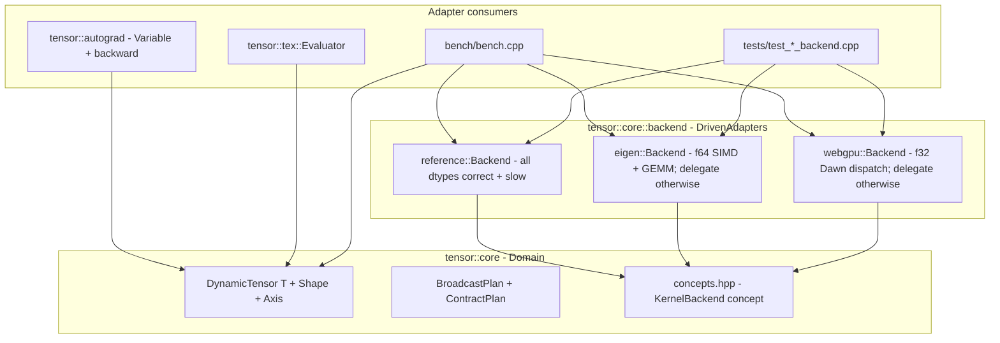

# `KernelBackend` — the port that decouples the Domain from execution

| Metadata     | Value                                                          |
| ------------ | -------------------------------------------------------------- |
| Version      | 1.0.0                                                          |
| Status       | Implemented (port declared in PR #19 / ADR-0011; three concrete adapters; verified end-to-end on RTX 3090 via PRs #60 / #61 / #62 / #67). |
| Type         | Module Detailed Design (Template 3 / arc42 §5 zoom-in)         |
| Owner        | uyuutosa                                                       |
| Source code  | [`include/tensor/core/concepts.hpp::KernelBackend`](../../include/tensor/core/concepts.hpp) (the port itself) + [`include/tensor/core/backend/{reference,eigen,webgpu}.hpp`](../../include/tensor/core/backend/) (the three concrete adapters) |
| Related ADRs | [ADR-0009](../arc42/09-decisions/0009-adopt-ddd-ubiquitous-language-and-hexagonal-lite.md) (Hexagonal lite — the port lives in `core::concepts`), [ADR-0010](../arc42/09-decisions/0010-refine-positioning-to-educational-first-production-capable.md) (educational-first, production-capable via backend adapters — *why* a port at all), [ADR-0011](../arc42/09-decisions/0011-kernel-backend-port-api.md) (the port API design — *which* methods), [ADR-0012](../arc42/09-decisions/0012-webgpu-adapter-implementation-design.md) (WebGPU's f32-only MVP — the type discipline every adapter follows), [ADR-0016](../arc42/09-decisions/0016-substrate-refinement-drop-gpu-cpp-talk-to-dawn-directly.md) (WebGPU substrate refinement). |
| Sibling designs | [`./tensor-core.md`](./tensor-core.md), [`./tensor-autograd.md`](./tensor-autograd.md), [`./tensor-tex.md`](./tensor-tex.md), [`./webgpu-element-wise-kernels.md`](./webgpu-element-wise-kernels.md), [`./webgpu-gemm-kernel.md`](./webgpu-gemm-kernel.md), [`./webgpu-broadcast-kernels.md`](./webgpu-broadcast-kernels.md) |
| Last Updated | 2026-05-12                                                     |

## Revision history

| Version | Date       | Summary                                                        |
| ------- | ---------- | -------------------------------------------------------------- |
| 1.0.0   | 2026-05-12 | Initial Template-3 design. The port itself has been stable since ADR-0011 (PR #19, 2026-05-11); this doc consolidates the per-method semantics + the adapter-construction discipline as the seventh and final planned Template-3 instance. |

---

## TL;DR

`KernelBackend` is a **C++20 concept** declared in `tensor::core::concepts` that any kernel-execution adapter must satisfy. It is the **port** in the project's Hexagonal-lite architecture ([ADR-0009](../arc42/09-decisions/0009-adopt-ddd-ubiquitous-language-and-hexagonal-lite.md)): the Domain (everything under `include/tensor/core/` outside `backend/`) depends only on this concept; concrete adapters under `include/tensor/core/backend/` depend on this concept; **no adapter depends on another adapter**. The concept names 14 methods grouped into 6 functional categories (element-wise binary ×4, element-wise unary ×4, broadcast ×3, contraction ×1, reduction ×1, unbroadcast ×1) plus a `backend_tag` typename marker. Three concrete adapters ship today: `reference`, `eigen`, `webgpu`. The webgpu adapter realises 12 of 14 methods as real GPU dispatch on `float`; the remaining methods delegate to `reference`. This document is the per-method semantics + the adapter-construction discipline; the strategic *why* lives in [ADR-0011](../arc42/09-decisions/0011-kernel-backend-port-api.md).

---

## 1. Context / Background

### 1.1 Why this module exists

The project's [ADR-0001](../arc42/09-decisions/0001-pivot-to-educational-named-axis-dsl.md) initially refused production positioning, accepting that the reference implementation would be slow. [ADR-0010](../arc42/09-decisions/0010-refine-positioning-to-educational-first-production-capable.md) softened that stance once the Hexagonal-lite design (ADR-0009) made it clear that production-grade kernels could plug in behind a port without touching the Domain. The port was named anticipatorily in `concepts.hpp` at that point; [ADR-0011](../arc42/09-decisions/0011-kernel-backend-port-api.md) (PR #19) finalised the surface.

After PRs #19–#22 the port had two adapters: `reference` and `eigen`. PR #38 added a `webgpu` stub. PRs #60 / #61 / #62 / #67 made the webgpu adapter dispatch real Dawn compute on a desktop GPU. The port itself hasn't changed since PR #19 — that stability is the proof the design is right-sized.

This document is the per-method reference. Strategic *why* lives in ADR-0011; how the WebGPU adapter implements each method lives in its three sibling detailed-design docs (element-wise, GEMM, broadcast).

### 1.2 Technical problem

A `KernelBackend` port for a named-axis tensor library has to answer four design questions:

1. **What's the dispatch unit?** Operations on full `DynamicTensor<T>` values (the choice we made) vs lower-level "compute this kernel over these buffers" primitives (closer to BLAS / CuBLAS interface).
2. **How does the port carry shape / layout info?** Pass `BroadcastPlan` / `ContractPlan` directly (the choice we made) vs let each adapter recompute the plan from the input shapes.
3. **What types must each adapter support?** All numeric types (chosen for `reference`) vs `float`-only fast-path with delegation otherwise (chosen for `eigen` GEMM and `webgpu`).
4. **How is the adapter selected?** Build-time CMake variable (chosen — `TENSOR_KERNEL_BACKEND={reference, eigen, webgpu}`) vs runtime dispatch via `std::variant` / virtual functions.

The shipped answers come together in 14 named methods, a `backend_tag` typename marker for compile-time identification, and the `static_assert(KernelBackend<Backend>)` line at the bottom of each adapter header.

### 1.3 Prerequisites / required knowledge

- [C++20 concepts](https://en.cppreference.com/w/cpp/language/constraints) — how the port is declared and how `static_assert(KernelBackend<B>)` works.
- [Hexagonal Architecture (Ports and Adapters)](https://alistair.cockburn.us/hexagonal-architecture/) — the architectural shape; [ADR-0009](../arc42/09-decisions/0009-adopt-ddd-ubiquitous-language-and-hexagonal-lite.md) for the project-specific variant.
- [`tensor::core::DynamicTensor`](../../include/tensor/core/dynamic_tensor.hpp), [`BroadcastPlan`](../../include/tensor/core/broadcast.hpp), [`ContractPlan`](../../include/tensor/core/contract.hpp) — the Domain types the port is parameterised over.
- arc42 §5 building blocks: [`../arc42/05-building-blocks/overview.md`](../arc42/05-building-blocks/overview.md).

---

## 2. Goals

- **Domain ↔ adapter decoupling**. The Domain compiles independently of any concrete backend; an adapter only needs to satisfy the concept.
- **Single source of truth for the port surface**. The 14-method concept in `concepts.hpp` is the only place adapters look; no parallel virtual-base-class interface.
- **Compile-time conformance check**. Every adapter header ends with `static_assert(KernelBackend<Backend>)`. If an adapter forgets a method, the build breaks at the adapter file, not at a user's call site.
- **Numerically interchangeable adapters at supported types**. `reference`'s output and `eigen`'s output (or `webgpu`'s) agree element-wise within the documented tolerance ([ADR-0012 § Decision Outcome point 5](../arc42/09-decisions/0012-webgpu-adapter-implementation-design.md)): `1e-9` for `double`, `1e-5` for `float`.
- **Adapter-level freedom on coverage**. An adapter that doesn't support a type or a particular shape is allowed to *delegate to reference* method-by-method. This is how `eigen` handles unsupported dtypes / non-simple GEMM and how `webgpu` handles non-float / non-simple cases.

---

## 3. Non-goals

- **A generic "compute this kernel" primitive**. The port speaks named operations, not opaque shaders or kernels. Adapters that want generic dispatch (`compute<F>(buf, n)`) build it inside themselves; the port doesn't.
- **Runtime polymorphism via virtual functions or `std::function`**. Adapter selection is compile-time via CMake. This avoids virtual-call overhead and keeps the port a pure C++20 concept.
- **A unified buffer type**. Each adapter may keep its own preferred buffer representation internally (`std::vector` for reference, `Eigen::Map` for eigen, `wgpu::Buffer` for webgpu); the port speaks only `DynamicTensor<T>`.
- **Type erasure on the adapter side**. `Backend` is a concrete class per adapter, not `std::function`-erased. The Domain templates a backend instance directly.
- **Output-shape inference inside the port methods**. `broadcast_*` and `contract` take a pre-computed `BroadcastPlan` / `ContractPlan`; the adapter doesn't recompute it.

---

## 4. Proposed design (as shipped)

### 4.1 Architecture overview



The single hard-rule arrow is **adapter → concept** (down). The Domain never depends on an adapter; adapters never depend on each other. The fact that `eigen::Backend` and `webgpu::Backend` both hold a private `reference::Backend ref_` member for the delegation path is the *adapter-internal* choice — the Domain knows nothing about it.

### 4.2 The concept in full

The literal source from [`concepts.hpp`](../../include/tensor/core/concepts.hpp) (PR #19, unchanged since):

```cpp
template <class B>
concept KernelBackend = requires(B b) {
    typename B::backend_tag;
} && requires(B b,
              DynamicTensor<double> const& a,
              DynamicTensor<double> const& a2,
              BroadcastPlan const& bplan,
              ContractPlan const& cplan,
              std::vector<std::size_t> const& source_map,
              DynamicShape const& source_shape) {
    // Element-wise binary, same shape.
    { b.add(a, a2) } -> std::same_as<DynamicTensor<double>>;
    { b.sub(a, a2) } -> std::same_as<DynamicTensor<double>>;
    { b.mul(a, a2) } -> std::same_as<DynamicTensor<double>>;
    { b.div(a, a2) } -> std::same_as<DynamicTensor<double>>;

    // Element-wise unary.
    { b.exp(a) }  -> std::same_as<DynamicTensor<double>>;
    { b.log(a) }  -> std::same_as<DynamicTensor<double>>;
    { b.relu(a) } -> std::same_as<DynamicTensor<double>>;
    { b.neg(a) }  -> std::same_as<DynamicTensor<double>>;

    // Broadcast element-wise.
    { b.broadcast_add(a, a2, bplan) } -> std::same_as<DynamicTensor<double>>;
    { b.broadcast_sub(a, a2, bplan) } -> std::same_as<DynamicTensor<double>>;
    { b.broadcast_mul(a, a2, bplan) } -> std::same_as<DynamicTensor<double>>;

    // Contraction (Einstein-style).
    { b.contract(a, a2, cplan) } -> std::same_as<DynamicTensor<double>>;

    // Reduction.
    { b.reduce_sum(a) } -> std::same_as<double>;

    // Unbroadcast (used by autograd to reduce dL/dout to an input's shape).
    { b.unbroadcast(a, source_map, source_shape) }
        -> std::same_as<DynamicTensor<double>>;
};
```

Two things to notice:

1. **The concept probes a `DynamicTensor<double>` instance**. Concepts can't directly express "this method must be a template", so the probe checks the `double` instantiation. An adapter that *only* supports `float` can still satisfy the concept by providing a `double` overload that delegates to `reference`. The webgpu adapter does this via `if constexpr (!std::is_same_v<T, float>) return ref_.method(...);` inside the template body.
2. **`typename B::backend_tag` is the discriminator**. Each adapter defines `struct backend_tag {};` (empty, just for the type system). Future code that wants to specialise on adapter type — e.g. a benchmark report that wants to print "eigen" vs "webgpu" — can match on `B::backend_tag`.

### 4.3 Per-method semantics

The 14 methods organised by category. For each one: signature, semantics, the three adapters' current behaviour, and which detailed-design covers it (if any).

#### 4.3.1 Element-wise binary — `add`, `sub`, `mul`, `div`

Signature:
```cpp
template <class T>
DynamicTensor<T> add(DynamicTensor<T> const& a, DynamicTensor<T> const& b) const;
```

Semantics: **same-shape** element-wise binary operation. Broadcasting (different shapes with shared labels) goes through `broadcast_*` instead — see §4.3.3. Output shape = input shape; output type = input type.

Adapter behaviour:

| Adapter | Behaviour |
| ------- | --------- |
| reference | Single-loop scalar; works for any T. |
| eigen | `Eigen::Map<Eigen::ArrayXd>` SIMD for `double`; delegates other T to reference. |
| webgpu | Dawn dispatch of `kAddF32` / `kSubF32` / `kMulF32` / `kDivF32` for `float`; delegates other T to reference. |

Sibling detailed-design: [`./webgpu-element-wise-kernels.md`](./webgpu-element-wise-kernels.md) (for the WebGPU side).

#### 4.3.2 Element-wise unary — `exp`, `log`, `relu`, `neg`

Signature:
```cpp
template <class T>
DynamicTensor<T> exp(DynamicTensor<T> const& a) const;
// same shape for log / relu / neg
```

Semantics: applied element-wise. `exp(a)` ≡ `out[i] = std::exp(a[i])`; `log(a)` ≡ `std::log(a[i])` (must be > 0 — caller's responsibility); `relu(a)` ≡ `max(a[i], 0)`; `neg(a)` ≡ `-a[i]`. These are the activation primitives the autograd subsystem ([`./tensor-autograd.md`](./tensor-autograd.md)) builds on.

Adapter behaviour:

| Adapter | Behaviour |
| ------- | --------- |
| reference | Single-loop scalar via `<cmath>`. |
| eigen | Delegates to reference (the Eigen adapter's SIMD wins on element-wise binary; for unary the win is smaller and the project didn't take it). |
| webgpu | Dawn dispatch of `kExpF32` / `kLogF32` / `kReluF32` / `kNegF32` for `float`; delegates other T to reference. |

#### 4.3.3 Broadcast element-wise — `broadcast_add`, `broadcast_sub`, `broadcast_mul`

Signature:
```cpp
template <class T>
DynamicTensor<T> broadcast_add(DynamicTensor<T> const& a,
                               DynamicTensor<T> const& b,
                               BroadcastPlan const& plan) const;
```

Semantics: Einstein-style label-aware broadcast (`a_i + b_j → c_{ij}`). The `BroadcastPlan` carries the result shape and source-axis maps; the adapter walks the result and uses [`tensor::core::project_index`](../../include/tensor/core/broadcast.hpp) (or its WGSL equivalent for `webgpu`) to project to the input flat indices. See [`./webgpu-broadcast-kernels.md`](./webgpu-broadcast-kernels.md) for the GPU implementation.

Notably the port doesn't expose `broadcast_div` — autograd doesn't use it, and adding it would be a strict surface addition for an unproven need. Future PR can add it if a use case appears.

Adapter behaviour:

| Adapter | Behaviour |
| ------- | --------- |
| reference | Walks result with `project_index` for every element. |
| eigen | Delegates to reference (broadcast doesn't fit Eigen's row-major `Map` ergonomics cleanly; outer-product cases would benefit but the project hasn't taken the optimisation). |
| webgpu | Dawn dispatch of `kBroadcastBodyF32` (templated by `{{op}}`) for `float`; max rank 8. Non-float and over-rank delegate to reference. |

#### 4.3.4 Contraction — `contract`

Signature:
```cpp
template <class T>
DynamicTensor<T> contract(DynamicTensor<T> const& a,
                          DynamicTensor<T> const& b,
                          ContractPlan const& plan) const;
```

Semantics: Einstein-convention summation over shared axis labels. With one shared axis, this is matvec or matmul depending on input ranks (`(M, K) × (K,)` → `(M,)` matvec; `(M, K) × (K, N)` → `(M, N)` matmul). With multiple shared axes, full multi-index summation. The `ContractPlan` carries result shape and per-axis source / shared labels.

Adapter behaviour:

| Adapter | Behaviour |
| ------- | --------- |
| reference | General `ContractPlan`-walking implementation; handles all shapes; slow on matmul. |
| eigen | Maps the **simple GEMM case** (1 shared axis, rank 2 × rank 1 or 2 × 2, canonical layout) to `Eigen::Map<Eigen::Matrix<double, ..., ..., Eigen::RowMajor>>` + matmul. Everything else delegates to reference. |
| webgpu | Same simple-GEMM case → Dawn dispatch of `kGemmF32` (tiled 16×16) for `float`. Everything else delegates. |

Sibling detailed-design: [`./webgpu-gemm-kernel.md`](./webgpu-gemm-kernel.md).

#### 4.3.5 Reduction — `reduce_sum`

Signature:
```cpp
template <class T>
T reduce_sum(DynamicTensor<T> const& a) const;  // returns scalar
```

Semantics: sums all elements to a scalar. Used by autograd's `sum_all` to produce the seed scalar at the top of the backward pass.

Adapter behaviour:

| Adapter | Behaviour |
| ------- | --------- |
| reference | Single-loop accumulate. |
| eigen | Delegates to reference (cache-bound; SIMD win small). |
| webgpu | **Delegates to reference**. Per [`./webgpu-broadcast-kernels.md` §5](./webgpu-broadcast-kernels.md) the host↔device round-trip dominates a scalar reduction on a small / moderate tensor; the educational reasoning is documented. Profile-driven revisit deferred to Phase 4+. |

#### 4.3.6 Unbroadcast — `unbroadcast`

Signature:
```cpp
template <class T>
DynamicTensor<T> unbroadcast(DynamicTensor<T> const& a,
                             std::vector<std::size_t> const& source_map,
                             DynamicShape const& source_shape) const;
```

Semantics: the inverse of broadcast. Given a result-shaped gradient `dL/dout`, sums along the result-axes that are *absent* on the source side (per `source_map`'s `broadcast_npos` entries) to produce a source-shaped gradient. Used by autograd's broadcast-aware backward. Lives in `tensor::core` (not `tensor::autograd`) since PR #20 so the port can reference it; see [`./tensor-core.md` §4.3`](./tensor-core.md) for the type-side narrative.

Adapter behaviour:

| Adapter | Behaviour |
| ------- | --------- |
| reference | Walks result, projects to source via `project_index`, accumulates. |
| eigen | Delegates to reference. |
| webgpu | **Delegates to reference**. Scatter-add on the GPU needs `atomicAdd`-on-float patterns (WGSL only supports `atomic<i32>` / `atomic<u32>`; float requires bit-cast through `u32` + CAS loop), which doesn't fit ADR-0013's "one readable kernel" framing. Profile-driven revisit deferred to Phase 4+. |

### 4.4 Adapter-construction discipline

Every adapter header follows the same shape:

```cpp
// 1. Hexagonal-discipline preamble.
#pragma once
#include "tensor/core/concepts.hpp"
#include "tensor/core/dynamic_tensor.hpp"
// ... (no #include of other adapters except for explicit delegation)

namespace tensor::core::backend::<name> {

// 2. The Backend class with a backend_tag typename.
class Backend {
public:
    struct backend_tag {};

    // 3. The 14 methods. Type-discipline:
    //    - Templates over T; the concept's `double` probe is satisfied
    //      by the double instantiation.
    //    - if constexpr (or runtime dispatch) for type-specific fast paths,
    //      else delegate to reference.

    template <class T>
    [[nodiscard]] DynamicTensor<T> add(DynamicTensor<T> const& a,
                                       DynamicTensor<T> const& b) const {
        // fast path for supported T, else delegate
    }
    // ... (13 more methods)

private:
    // 4. Private delegation helper for unsupported cases. Eigen and
    //    WebGPU both keep a `reference::Backend ref_;` here.
    tensor::core::backend::reference::Backend ref_;
};

// 5. Compile-time concept check. If a method is missing or has the
//    wrong signature, this line fails and points at the adapter.
static_assert(KernelBackend<Backend>,
              "<name>::Backend must satisfy KernelBackend");

}  // namespace
```

The `static_assert` line is the **single line that catches an adapter regression at the source**. Without it, a missing method would only surface when downstream code (autograd, tests, the bench) tries to call it.

The `reference::Backend ref_` member in `eigen::Backend` and `webgpu::Backend` is the adapter's choice of how to handle unsupported cases. The Domain doesn't know about this delegation — to the Domain, `eigen::Backend::add(a, b)` is a single call that returns a tensor; what happens inside is opaque.

### 4.5 How the backend is selected at build time

`CMakeLists.txt` exposes a `TENSOR_KERNEL_BACKEND` cache variable with values `{reference, eigen, webgpu}` ([§7 deployment](../arc42/07-deployment/overview.md)). The variable controls:

1. Which third-party libraries are pulled in (`find_package(Eigen3 ...)` only for `eigen`; `find_package(Dawn ...)` only for `webgpu`).
2. Which preprocessor define is set (`TENSOR_HAS_EIGEN` / `TENSOR_HAS_WEBGPU`).
3. Conditional includes in test / bench code (`#if defined(TENSOR_HAS_EIGEN)`).

The Domain code itself doesn't read these defines — it doesn't need to know which backend is active. Consumer code (test files, benchmarks, tutorial 08) picks an adapter by *type* (instantiate `reference::Backend r; eigen::Backend e;`) and calls methods on it.

This is by design: the Domain is shape-aware and type-aware, but *backend-agnostic*. A future tutorial that wants to demonstrate "swap backends at runtime" could wrap multiple backends in a `std::variant` — but the port itself doesn't carry that machinery.

---

## 5. Alternatives considered

### 5.1 Virtual base class with runtime polymorphism

Considered + rejected by [ADR-0011](../arc42/09-decisions/0011-kernel-backend-port-api.md) §Considered Options point 2:

```cpp
class IKernelBackend {
public:
    virtual ~IKernelBackend() = default;
    virtual DynamicTensor<double> add(...) = 0;
    // ... 13 more virtual methods
};
```

Why rejected: every call goes through a virtual dispatch, ~5ns overhead per call, which compounds in the autograd hot path. C++20 concepts give the same compile-time interface check without runtime cost. The downside — template instantiation surface — is acceptable for a header-only library.

### 5.2 One generic dispatch primitive

Considered + rejected by ADR-0011 §Considered Options point 1:

```cpp
template <class B>
concept KernelBackend = requires(B b) {
    { b.dispatch<...>(...) } -> ...;
};
```

Why rejected: forces every adapter to internally route on operation name (an enum or string), reintroducing the dispatch logic the port was supposed to externalise. Per-method named API ((`add` / `sub` / ...) keeps the surface concrete and adapter implementations short.

### 5.3 Type-erased `std::function`-based interface

Considered + rejected: same virtual-dispatch cost as 5.1 with the extra allocations of `std::function`'s small-object optimisation occasionally failing on large captures. Concept-based static interface is strictly better here.

### 5.4 Backend selection at call site rather than configure time

Considered + rejected by [`./tensor-core.md` §5.4`](./tensor-core.md). Per-call backend selection makes the most sense when one process uses multiple GPUs simultaneously — out of the project's current scope. The build-time choice is simpler, faster, and doesn't preclude future per-call dispatch as a layer on top.

### 5.5 More methods (e.g. `broadcast_div`, `reduce_max`, `softmax`)

The port currently names what the autograd subsystem and the tutorials actually need. Adding methods is cheap (concept + adapter implementations + tests), but each new method commits all current and future adapters to providing it. The discipline is: add a method only when a Domain consumer actually calls it. Currently the candidates are:

- **`broadcast_div`** — autograd's `Variable::operator/` doesn't use it (uses `div` after explicit broadcast through `broadcast_add` / `broadcast_mul`).
- **`reduce_max`** — would be needed for `softmax` and other normalisations; deferred.
- **Specialised activations** (`sigmoid`, `tanh`, `gelu`) — buildable from `exp` / `log` / `neg`; not separately ported.

These are not non-goals — they're "not yet". The port is designed to grow when a need appears.

---

## 6. Testing strategy

| Test file | What it asserts |
| --------- | --------------- |
| [`tests/test_reference_backend.cpp`](../../tests/test_reference_backend.cpp) | `static_assert(KernelBackend<reference::Backend>)` passes; each method produces a correct output on a small input. |
| [`tests/test_eigen_backend.cpp`](../../tests/test_eigen_backend.cpp) | Same concept check + cross-validates `eigen` outputs against `reference` within `1e-9` for `double`. |
| [`tests/test_webgpu_backend.cpp`](../../tests/test_webgpu_backend.cpp) | Concept check + cross-validates `webgpu` outputs against `reference` within `1e-9` for `double` (delegated path) and `1e-5` for `float` (real GPU dispatch path). |
| [`tests/test_webgpu_wgsl.cpp`](../../tests/test_webgpu_wgsl.cpp) | Text-level validation of the WGSL kernel sources that back the webgpu adapter's methods. |
| [`bench/bench.cpp`](../../bench/bench.cpp) | Measures the same methods across backends for the report — see [`docs/reports/2026-05-11_backend-performance-comparison.md`](../reports/2026-05-11_backend-performance-comparison.md). |

The `static_assert(KernelBackend<Backend>)` line at the bottom of each adapter header is the canonical conformance check; the cross-validation tests are the *semantic* check that two different implementations of the same port produce the same output.

---

## 7. Cross-references

- arc42 §5 building blocks (where this port is named — the central abstraction of the diagram): [`../arc42/05-building-blocks/overview.md`](../arc42/05-building-blocks/overview.md)
- §6 runtime scenarios (Scenario 4 — backend swap at configure time): [`../arc42/06-runtime/overview.md`](../arc42/06-runtime/overview.md)
- §10 quality QO-1 (numerical agreement across backends — the cross-validation tolerance the port discipline produces): [`../arc42/10-quality/overview.md`](../arc42/10-quality/overview.md)
- §12 glossary entries: `Port`, `Adapter`, `KernelBackend`: [`../arc42/12-glossary/overview.md`](../arc42/12-glossary/overview.md)
- ADRs anchored: [ADR-0009](../arc42/09-decisions/0009-adopt-ddd-ubiquitous-language-and-hexagonal-lite.md), [ADR-0010](../arc42/09-decisions/0010-refine-positioning-to-educational-first-production-capable.md), [ADR-0011](../arc42/09-decisions/0011-kernel-backend-port-api.md), [ADR-0012](../arc42/09-decisions/0012-webgpu-adapter-implementation-design.md), [ADR-0016](../arc42/09-decisions/0016-substrate-refinement-drop-gpu-cpp-talk-to-dawn-directly.md)
- Sibling detailed designs covering the same port from different angles: [`./tensor-core.md`](./tensor-core.md) (the Domain that calls the port), [`./tensor-autograd.md`](./tensor-autograd.md) (autograd as the heaviest port consumer), the **WebGPU adapter trio** ([`./webgpu-element-wise-kernels.md`](./webgpu-element-wise-kernels.md), [`./webgpu-gemm-kernel.md`](./webgpu-gemm-kernel.md), [`./webgpu-broadcast-kernels.md`](./webgpu-broadcast-kernels.md))
- The shipping PRs that built each adapter:
  - reference adapter: PR #19 + #20 (port + first implementation, 2026-05-11)
  - eigen adapter: PR #21 (SIMD + GEMM, 2026-05-11)
  - webgpu adapter: PR #38 (stub) → #60 + #61 + #62 (dispatch wiring, 2026-05-11/12) → #67 (perf measurement)
- Tutorial that exercises this port end-to-end: [`tutorials/08_swappable-backends.ipynb`](../../tutorials/08_swappable-backends.ipynb) (reference vs eigen at the Domain level); [`tutorials/06_webgpu-acceleration.ipynb`](../../tutorials/06_webgpu-acceleration.ipynb) (WebGPU implementation details).
