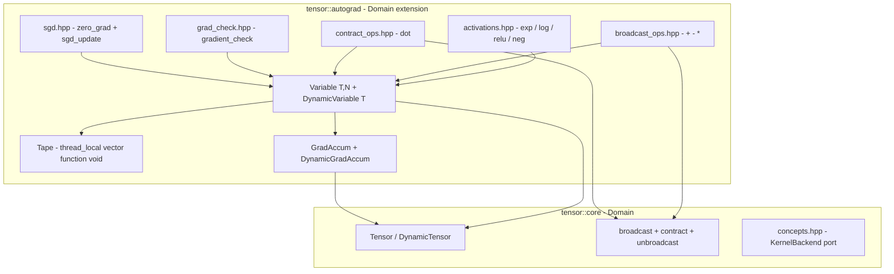

# `tensor::autograd` — tape-based reverse-mode autograd over named-axis tensors

| Metadata     | Value                                                          |
| ------------ | -------------------------------------------------------------- |
| Version      | 1.0.0                                                          |
| Status       | Implemented (Phase 2 full + Phase 1.5 zero_grad / sgd_update)  |
| Type         | Module Detailed Design (Template 3 / arc42 §5 zoom-in)         |
| Owner        | uyuutosa                                                       |
| Source code  | [`include/tensor/autograd/`](../../include/tensor/autograd/)    |
| Related ADRs | [ADR-0007](../arc42/09-decisions/0007-adopt-autograd-as-first-class-subsystem.md), [ADR-0009](../arc42/09-decisions/0009-adopt-ddd-ubiquitous-language-and-hexagonal-lite.md), [ADR-0011](../arc42/09-decisions/0011-kernel-backend-port-api.md), [ADR-0015](../arc42/09-decisions/0015-aspire-to-canonical-reference-quality-not-self-anoint.md) (superseding [ADR-0013](../arc42/09-decisions/0013-reframe-as-canonical-reference-for-named-tensor-computation.md)) |
| Sibling      | [`tensor-core.md`](./tensor-core.md) (Domain centerpiece this module extends) |
| Last Updated | 2026-05-11                                                     |

## Revision history

| Version | Date       | Summary                                                        |
| ------- | ---------- | -------------------------------------------------------------- |
| 1.0.0   | 2026-05-11 | Initial Template-3 detailed design covering Phase 2 + Phase 1.5 shipped state. |

---

## TL;DR

`tensor::autograd` is the **Domain extension** that gives the project end-to-end differentiable computation. It implements tape-based reverse-mode autograd over named-axis tensors with the minimum machinery that pedagogy requires: a thread-local `Tape` of `std::function<void()>` backward closures, a `Variable<T, N>` / `DynamicVariable<T>` wrapper, per-primitive registered backward (`+`, `-`, `*`, `exp`, `log`, `relu`, `neg`, `dot`, broadcast-aware variants), a `gradient_check` finite-difference verifier, and the `zero_grad` / `sgd_update` ergonomics needed for a training loop. The subsystem depends on `tensor::core` and the `KernelBackend` port but `core` does not depend on `autograd` — the Hexagonal-lite rule from ADR-0009 carries through unchanged.

---

## 1. Context / Background

### 1.1 Why this module exists

[ADR-0007](../arc42/09-decisions/0007-adopt-autograd-as-first-class-subsystem.md) committed the project to first-class automatic differentiation as part of the educational pitch: a learner who has built a tensor library should be able to make it learn from data without leaving the codebase. Phase 2 (PRs #10-#17) is the work product of that commitment. Phase 1.5 (PR #26) added the `zero_grad` + `sgd_update` ergonomics that turn the subsystem from "computes gradients" into "runs a training loop end-to-end."

### 1.2 Technical problem

A canonical-reference autograd implementation in C++20 must answer three design questions:

1. **What does a `Variable` carry?** A pointer to a `Tensor`? A copy? A `shared_ptr`? Lifetime ownership decides what `backward()` can assume.
2. **How is the tape stored?** Per-thread, per-process, per-Variable? The choice determines what concurrency model the library supports and what cleanup looks like.
3. **How do shape changes propagate through backward?** A forward broadcast `a_i + b_j → c_{ij}` must, in backward, *unbroadcast* the result-shaped gradient back into source-shaped slots. The unbroadcast primitive lives in the Domain (`tensor::core::unbroadcast` per PR #20) so autograd doesn't reinvent it.

The answers from PRs #10-#26: `Variable` holds a `shared_ptr`-managed value + grad + backward closure; tape is thread-local `std::vector<std::function<void()>>`; backward uses `tensor::core::unbroadcast` to honor broadcast-aware gradients.

### 1.3 Prerequisites / required knowledge

- [Reverse-mode automatic differentiation](https://en.wikipedia.org/wiki/Automatic_differentiation#Reverse_accumulation) — the algorithm this module implements. The Wengert tape original ([Wengert 1964, "A simple automatic derivative evaluation program"]) and its modern rediscovery (PyTorch's tape, JAX's traced jaxpr, micrograd / tinygrad's `_backward` closures) are the influences.
- [`micrograd`](https://github.com/karpathy/micrograd) and [`tinygrad`](https://github.com/tinygrad/tinygrad) — the educational precedents the project follows. ADR-0007 §References names them.
- [`tensor::core`](./tensor-core.md) — the Domain types this module wraps; `unbroadcast` and `contract_with_plan` in particular.
- arc42 [§5 Building Blocks](../arc42/05-building-blocks/overview.md) — where this container sits.

---

## 2. Goals

- Reverse-mode autograd that runs on top of the existing `KernelBackend` port without inventing a parallel execution path.
- Every autograd primitive has a finite-difference-checked correctness witness (`gradient_check`).
- Broadcast-aware backward: gradients of broadcast operators correctly contract along the broadcast axes via `unbroadcast`.
- Named-axis contraction (`dot`) supports both autograd directions through the same `contract_with_plan` kernel that the forward uses (no separate "backward kernel").
- Ergonomic training loop: `zero_grad()` resets gradient accumulators in-place; `sgd_update(params, lr)` is a one-line parameter step.

---

## 3. Non-goals

- **Forward-mode autograd.** Tape-based reverse-mode only; forward-mode is a future complementary subsystem ([ADR-0007 §Out-of-scope](../arc42/09-decisions/0007-adopt-autograd-as-first-class-subsystem.md), [ADR-0001 §Out-of-scope](../arc42/09-decisions/0001-pivot-to-educational-named-axis-dsl.md)).
- **Higher-order derivatives.** No `backward(backward(loss))`. Possible later as a research item; not in the current pedagogical arc.
- **Source-to-source transformation.** No JAX-style traced compilation. The tape is dynamic, not symbolic.
- **Custom backward kernels.** Each registered closure uses existing Domain operations; no autograd-specific GPU kernel.
- **Operator fusion across the tape.** Every operation allocates an intermediate tensor (matches `tensor::core`'s no-expression-templates choice — see [`./tensor-core.md` §5.3](./tensor-core.md)).

---

## 4. Proposed design (as shipped)

### 4.1 Architecture overview



Every arrow points *into* the Domain. The reverse direction (Domain → autograd) is forbidden by ADR-0009's hard rule. The whole subsystem can be removed and the Domain still compiles.

### 4.2 The `Variable` type

A `Variable<T, N>` holds three pieces (similar layout for `DynamicVariable<T>`):

```cpp
template <class T, std::size_t N>
class Variable {
    std::shared_ptr<Tensor<T, N>> value_;       // forward value
    std::shared_ptr<GradAccum<T, N>> grad_;     // accumulated gradient (same shape as value_)
    std::function<void()> backward_;            // closure registered when operator+ / * / ... ran

    // Construction copies into shared_ptr; copying a Variable just bumps refcounts.
};
```

Three design choices encoded here:

- **`shared_ptr` ownership** — when `c = a + b` registers a backward closure, the closure captures shared_ptr copies of `a.grad_` / `b.grad_`. The closure outlives `a` / `b` if a user drops their handles but keeps `c`; the gradients still flow.
- **Grad has the same shape as value** — `Variable` cannot have a runtime-rank mismatch between its value and its gradient. The two move together.
- **Backward closure is `std::function<void()>`** — type-erased, allocated per operator. Performance cost is real (R-Q1 risk in §11); legibility cost would be larger if we templated over closure type, so the choice favours priority 1 (clarity).

The dynamic variant `DynamicVariable<T>` holds `DynamicTensor<T>` and `DynamicGradAccum<T>` identically — same design, runtime rank.

### 4.3 The `Tape`

```cpp
class Tape {
public:
    static Tape& current() { thread_local Tape t; return t; }
    void record(std::function<void()> closure) { closures_.push_back(std::move(closure)); }
    void run_backward();  // walks closures_ in reverse, calls each
    void clear();         // training-loop hygiene
private:
    std::vector<std::function<void()>> closures_;
};
```

Key properties:

- **`thread_local`** — two threads doing autograd see independent tapes. The library has no cross-thread synchronisation primitive (per [§8 §3 concurrency model](../arc42/08-crosscutting/overview.md)).
- **Append-only during forward** — operators push closures; nothing pops them until backward.
- **Walked in reverse** — `run_backward()` iterates `closures_` from last to first. Each closure reads its captured upstream gradient(s) and updates the downstream `GradAccum`.

`Variable::backward()` is sugar over `Tape::current().run_backward()` that seeds the upstream gradient with 1.0 (for scalar loss) or a user-provided seed tensor.

### 4.4 Per-primitive registered backward

Each operator follows the same shape:

```cpp
auto operator+(Variable const& a, Variable const& b) {
    auto out = make_variable(/* forward: */ tensor::core::ops::add(a.value(), b.value()));
    Tape::current().record([
        wa = std::weak_ptr{a.grad_ptr()},
        wb = std::weak_ptr{b.grad_ptr()},
        wout = std::weak_ptr{out.grad_ptr()}
    ] {
        if (auto ga = wa.lock())  ga->accumulate(*wout.lock());     // ∂L/∂a = ∂L/∂out
        if (auto gb = wb.lock())  gb->accumulate(*wout.lock());     // ∂L/∂b = ∂L/∂out
    });
    return out;
}
```

The pattern is identical for `-`, `*` (with chain-rule scaling by the other operand), the activations (with derivative computed from `out.value()` for `exp` and `relu`, from `out.value()` for `log` and `neg`), and `dot` (using `contract_with_plan` for both directions per §4.5).

**Broadcast-aware backward** (`broadcast_ops.hpp`): when the forward call computed a `BroadcastPlan`, the closure captures the plan's `a_source` / `b_source` maps and calls `tensor::core::unbroadcast(grad_out, source_map, source_shape)` to project the result-shaped gradient back into the source-shaped accumulator. This is the only autograd primitive that requires a Domain symbol promotion from `tensor::autograd::detail` to `tensor::core` (PR #20).

### 4.5 Contraction's autograd (`contract_ops.hpp`)

`dot(a, b)` is the named-axis contraction. The backward closure exploits a property of single-shared-axis contraction:

```
forward:   c_{ij} = Σ_k a_{ik} * b_{kj}    (a is rank-2, b is rank-2, shared axis k)
backward:  ∂L/∂a_{ik} = Σ_j ∂L/∂c_{ij} * b_{kj}   ← contract(grad_out, b) along j
           ∂L/∂b_{kj} = Σ_i a_{ik} * ∂L/∂c_{ij}   ← contract(a, grad_out) along i
```

Both gradient computations are themselves contractions. The closure calls `contract_with_plan` with reorganised plans — same kernel as the forward, just with different shared-axis selections. **No new GPU kernel for backward.**

### 4.6 `gradient_check` — the correctness witness

```cpp
template <class T, class F>
bool gradient_check(F f, Variable<T, ...> const& x, T eps = 1e-5, T tol = 1e-5);
```

Computes the analytical gradient via `f(x).backward()` and the finite-difference gradient via central differences `(f(x + ε) - f(x - ε)) / (2ε)`, returns whether they agree within `tol`. Every autograd primitive has a `gradient_check`-based test under [`tests/test_autograd_*.cpp`](../../tests/). This is [§10 QO-2](../arc42/10-quality/overview.md)'s response measure.

### 4.7 Training loop ergonomics (`sgd.hpp`)

`Variable::zero_grad()` resets the gradient tensor's elements to 0 in-place. `sgd_update(params, lr)` walks a span of `Variable`s, subtracts `lr * grad` from each `value`, and zeros the grad. These two functions turn the subsystem from "computes gradients" into "runs a training loop":

```cpp
// Tutorial 07's MLP training loop, schematically:
for (int epoch = 0; epoch < 200; ++epoch) {
    auto loss = forward(W, b, x, y);     // builds tape
    loss.backward();                      // walks tape
    sgd_update({W, b}, /* lr = */ 0.01);  // updates + zero_grads
    Tape::current().clear();              // releases closures for next epoch
}
```

The convergence to `W ≈ 2`, `b ≈ 1` on the toy `y = 2x + 1` regression after 200 epochs is the canonical Phase 2 closure witness.

---

## 5. Alternatives considered

### 5.1 Eager-mode autograd without a tape

PyTorch's original "autograd functions" recorded backward by holding references to the inputs and producing an output that knew how to invoke `backward()` directly. Rejected because: (a) the tape model is more legible — `Tape::record()` makes the registration step visible; (b) the closure form composes naturally with `gradient_check`'s repeated forward / backward; (c) the tape allows `Tape::current().clear()` between training iterations to release closures, a hygiene control that's tedious in the eager model.

### 5.2 Static expression DAG (JAX-style)

JAX traces Python functions into a `jaxpr` symbolic representation and differentiates the trace. Rejected because: (a) requires a tracer infrastructure the project would have to invent; (b) hides the algorithm — a learner reading `loss.backward()` should see a for-loop, not a transformed AST; (c) eliminates dynamic shapes from training-loop control flow, which the educational pitch needs.

### 5.3 Custom backward GPU kernels per primitive

A "real" production autograd library might ship a specialised GPU kernel for, e.g., the backward of `softmax` that doesn't materialise the Jacobian. Rejected because: (a) doubles the GPU surface (forward + backward kernels) — currently the project ships forward kernels only and re-uses them for backward (see §4.5); (b) the educational pitch is that you can implement backward in terms of forward primitives, and adding bespoke backward kernels would obscure that lesson.

### 5.4 `unique_ptr` ownership of `Variable`'s value / grad

A simpler ownership model than `shared_ptr`. Rejected because backward closures must outlive the user's handle to a `Variable` — when the user writes `auto c = a + b; auto d = c * 2;` and then drops `c`, the closure for `+` still needs `b.grad_` reachable. `shared_ptr` is the minimum machinery that makes this safe.

---

## 6. Testing strategy

| Test file | Surface |
| --------- | ------- |
| [`tests/test_autograd.cpp`](../../tests/test_autograd.cpp) | `Variable<T, N>` construction, `sum_all`, basic `backward()`, `Tape::clear()`. |
| [`tests/test_autograd_activations.cpp`](../../tests/test_autograd_activations.cpp) | `exp`, `log`, `relu`, `neg` forward + finite-difference-checked backward. |
| [`tests/test_autograd_broadcast.cpp`](../../tests/test_autograd_broadcast.cpp) | `DynamicVariable<T>` + broadcast-aware backward (uses `unbroadcast`). |
| [`tests/test_autograd_dot.cpp`](../../tests/test_autograd_dot.cpp) | `dot` matvec + matmul autograd; both directions reuse `contract_with_plan`. |
| [`tests/test_autograd_zero_grad_sgd.cpp`](../../tests/test_autograd_zero_grad_sgd.cpp) | `zero_grad` + `sgd_update`; toy `y = 2x + 1` regression converges to W ≈ 2, b ≈ 1 after 300 epochs. |

Bundle B (PR #109) added three new test files for the trig / division / reduce extensions:

| Test file (added Bundle B) | Surface |
| --------- | ------- |
| [`tests/test_autograd_trig_sqrt.cpp`](../../tests/test_autograd_trig_sqrt.cpp) | `sin`, `cos`, `sqrt` forward + closed-form backward against `Approx` tolerances. |
| [`tests/test_autograd_div.cpp`](../../tests/test_autograd_div.cpp) | `operator/` on `DynamicVariable` — quotient-rule backward + broadcast-aware `unbroadcast`. |
| [`tests/test_autograd_reduce.cpp`](../../tests/test_autograd_reduce.cpp) | `reduce_along_label` — single-axis sum + gradient broadcast back along the reduced axis. |

**Python parity**: `python/tests/test_autograd.py` + `python/tests/test_autograd_extensions.py` cross-validate every Python entry point against the same C++ canonical answer within `1e-12` for `double` / `1e-5` for `float` (the QO-4 envelope per [`../arc42/10-quality/overview.md`](../arc42/10-quality/overview.md)). When new autograd primitives are added, the contributor adds both the C++ doctest case AND the Python pytest case in the same PR.

The 9-job C++ CI matrix executes all of these on every PR plus the Python wheel smoke for the parity tests.

---

## 7. Cross-references

- arc42 §5 (where this container is named): [`../arc42/05-building-blocks/overview.md`](../arc42/05-building-blocks/overview.md)
- §6 Scenario 3 (autograd backward pass walkthrough): [`../arc42/06-runtime/overview.md`](../arc42/06-runtime/overview.md)
- §10 (quality scenarios this design must uphold): QO-2 (gradient_check is the primary witness), QO-4 (Python ↔ C++ parity), QC-1 + QC-2 (legibility + diagnostics) per [`../arc42/10-quality/overview.md`](../arc42/10-quality/overview.md)
- §12 (vocabulary): [`../arc42/12-glossary/overview.md`](../arc42/12-glossary/overview.md) — `Variable`, `Tape`, `Gradient check`, `DynamicVariable (Python)`, `reduce_along_label`.
- ADRs anchored: [ADR-0007](../arc42/09-decisions/0007-adopt-autograd-as-first-class-subsystem.md), [ADR-0009](../arc42/09-decisions/0009-adopt-ddd-ubiquitous-language-and-hexagonal-lite.md), [ADR-0018](../arc42/09-decisions/0018-phase-6-python-sdk-entry-via-nanobind.md) (Python mirror surface).
- Sibling detailed designs: [`./tensor-core.md`](./tensor-core.md), [`./tensor-tex.md`](./tensor-tex.md), [`./kernel-backend-port.md`](./kernel-backend-port.md), [`./python-sdk-binding-surface.md`](./python-sdk-binding-surface.md), [`./webgpu-element-wise-kernels.md`](./webgpu-element-wise-kernels.md), [`./webgpu-gemm-kernel.md`](./webgpu-gemm-kernel.md), [`./webgpu-broadcast-kernels.md`](./webgpu-broadcast-kernels.md).
- Tutorial that exercises this module end-to-end: [`tutorials/05_autograd-from-scratch.ipynb`](../../tutorials/05_autograd-from-scratch.ipynb), [`tutorials/07_mlp-on-toy.ipynb`](../../tutorials/07_mlp-on-toy.ipynb).
- Python notebooks: [`python/notebooks/01_python-autograd.ipynb`](../../python/notebooks/01_python-autograd.ipynb) (autograd tour), [`python/notebooks/03_multifocal-tensors.ipynb`](../../python/notebooks/03_multifocal-tensors.ipynb) (MVG via autograd), [`python/notebooks/04_python-bundle-adjustment-perspective.ipynb`](../../python/notebooks/04_python-bundle-adjustment-perspective.ipynb) (BA with `sin`/`cos`/`__truediv__`).
- Python public surface that consumes this module: [`../api-contract/python-public-surface.md` §3](../api-contract/python-public-surface.md).

## 8. Future work

- **Forward-mode autograd** (JVP / dual-number style) — explicitly out of scope per ADR-0007's "tape-based reverse-mode" choice. Would require a second tape implementation and double the test surface.
- **Higher-order gradients** — `backward(backward(loss))` is currently undefined; the tape clears after one walk. A "double backward" path is reachable but the per-tape-entry storage cost doubles. Defer until a Phase 7+ teaching surface needs it (e.g. a Hessian-vector-product demo).
- **GPU autograd backward kernels** — the WGSL kernel pack covers forward only; backward routes through reference. Phase 6.5 follow-up: lift the broadcast / contract backward into WGSL once the corresponding forward kernels are stable.
- **Pytorch-style retain_graph parameter** — currently every `backward()` clears the tape. A `retain_tape=true` parameter would enable retraining without recomputing the graph; deferred behind a measured signal.
- **Bundle C (planned)** — `tan` / `atan2` / `pow` activations to unblock SO(3) Lie-algebra rotation parameterisations in a future BA-with-rotations-on-the-manifold notebook. Tracked as a Phase 6 follow-up; no impl-plan yet.
