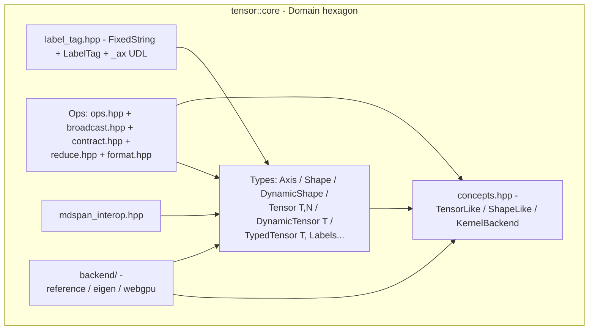

# `tensor::core` — Domain centerpiece

| Metadata     | Value                                                          |
| ------------ | -------------------------------------------------------------- |
| Version      | 1.0.0                                                          |
| Status       | Implemented (Phase 1 + Phase 1.5 + Phase 2.5 backend port)     |
| Type         | Module Detailed Design (Template 3 / arc42 §5 zoom-in)         |
| Owner        | uyuutosa                                                       |
| Source code  | [`include/tensor/core/`](../../include/tensor/core/)            |
| Related ADRs | [ADR-0002](../arc42/09-decisions/0002-rewrite-on-cpp20-baseline-with-mdspan-interop.md), [ADR-0004](../arc42/09-decisions/0004-adopt-hybrid-named-axis-api.md), [ADR-0009](../arc42/09-decisions/0009-adopt-ddd-ubiquitous-language-and-hexagonal-lite.md), [ADR-0011](../arc42/09-decisions/0011-kernel-backend-port-api.md), [ADR-0015](../arc42/09-decisions/0015-aspire-to-canonical-reference-quality-not-self-anoint.md) (superseding [ADR-0013](../arc42/09-decisions/0013-reframe-as-canonical-reference-for-named-tensor-computation.md)) |
| Last Updated | 2026-05-11                                                     |

## Revision history

| Version | Date       | Summary                                                        |
| ------- | ---------- | -------------------------------------------------------------- |
| 1.0.0   | 2026-05-11 | Initial Template-3 detailed design covering the Phase 1+1.5+2.5 shipped state of `tensor::core`. |

---

## TL;DR

`tensor::core` is the **Domain centerpiece** of the project's Hexagonal-lite architecture. It owns the named-axis tensor algebra: `Axis`, `Shape` / `DynamicShape`, `Tensor<T,N>` / `DynamicTensor<T>` / `TypedTensor<T, Labels...>`, broadcast (Einstein-style, label-aware), contraction (single-shared-axis matvec / matmul), `mdspan` interop, and the `KernelBackend` port that all execution adapters satisfy. The headers under `include/tensor/core/` are the only part of the codebase that may not depend on any adapter — they are the source of the project's *vocabulary* (per the [§12 glossary](../arc42/12-glossary/overview.md)) and the most cite-able artifact under the canonical-reference-quality aspiration (ADR-0015, superseding ADR-0013).

---

## 1. Context / Background

### 1.1 Why this module exists

`tensor::core` is the substantive answer to the project's question: *what is the smallest, most readable C++20 surface that lets a learner write `c_{ij} = a_i + b_j` and have it execute, on any backend, with named-axis semantics throughout?*

The container is the work product of:

- **Phase 1** (PRs #1-#8) — the original Domain types: `Axis`, `Shape<N>`, `Tensor<T,N>`, runtime broadcast (`+ - * /`), function / reference tensors, `mdspan` interop.
- **Phase 1.5** (PRs #23, #24, #30) — compile-time-labelled extension: `LabelTag`, `FixedString`, `_ax` UDL, `TypedTensor<T, Labels...>`, and the macro-based mdspan polyfill namespace adapter.
- **Phase 2.5** (PRs #19, #20) — the `KernelBackend` port (`concepts.hpp`) and the `reference::Backend` adapter that lives under `include/tensor/core/backend/`. The port is the Domain's contract with execution.

### 1.2 Technical problem

A named-axis tensor library must answer four design questions and answer them coherently:

1. **Where do axis labels live?** Compile-time (NTTPs, statically checked, no allocation), runtime (heap `std::string_view`, dynamic), or both?
2. **How is broadcasting defined?** Positional (NumPy-style) or label-driven (Einstein-style)?
3. **How is contraction defined?** Implicit (repeated indices sum) or explicit (call `contract`)?
4. **How does execution plug in?** Hard-coded CPU loops or a swappable port?

`tensor::core` answers, in order: **both** (`ADR-0004` hybrid runtime + NTTP), **label-driven** (matches the math literature), **explicit `contract`** (consteval parsing is the future for implicit, but the runtime API stays explicit for readability), **swappable port** (the `KernelBackend` concept; `ADR-0009` + `ADR-0011`).

### 1.3 Prerequisites / required knowledge

- [Einstein summation convention](https://en.wikipedia.org/wiki/Einstein_notation) — the algebraic model the named-axis API implements.
- [C++20 concepts](https://en.cppreference.com/w/cpp/language/constraints) — how ports are declared.
- [P0009 mdspan](https://www.open-std.org/jtc1/sc22/wg21/docs/papers/2022/p0009r17.html) and the [kokkos/mdspan polyfill](https://github.com/kokkos/mdspan) — how the interop layer works.
- [Hexagonal Architecture (Ports and Adapters)](https://alistair.cockburn.us/hexagonal-architecture/) — the architectural shape `tensor::core` participates in.
- arc42 [§5 Building Blocks](../arc42/05-building-blocks/overview.md) — where this container sits in the project's static decomposition.

---

## 2. Goals

- Provide a small, readable Domain surface (every public symbol is in the [§12 glossary](../arc42/12-glossary/overview.md)).
- Support both runtime-label and compile-time-label paths so a learner picks the right tool ([`docs/user-manual/how-to/named-tensor-types.md`](../user-manual/how-to/named-tensor-types.md)).
- Stay backend-agnostic: no header under `include/tensor/core/` (other than `concepts.hpp`) may know which `KernelBackend` is active.
- Reproduce the 2016 README's broadcast tables byte-for-byte (quality scenario [QO-3](../arc42/10-quality/overview.md)).
- Expose `mdspan` interop so users can hand tensors to other libraries that accept `std::mdspan` ([ADR-0002](../arc42/09-decisions/0002-rewrite-on-cpp20-baseline-with-mdspan-interop.md)).

---

## 3. Non-goals

- **Coverage parity with Eigen / xtensor / libtorch.** Operators are added because they teach, not for completeness ([ADR-0001 §Out of scope](../arc42/09-decisions/0001-pivot-to-educational-named-axis-dsl.md)).
- **Sparse-tensor first-class support.** ADR-0001 explicitly defers; revisitable as a future adapter ([§7 cross-references](#7-cross-references)).
- **Forward-mode autograd inside core.** `tensor::core` is autograd-unaware; `tensor::autograd` consumes core types but core knows nothing about gradients ([ADR-0007](../arc42/09-decisions/0007-adopt-autograd-as-first-class-subsystem.md), [ADR-0009](../arc42/09-decisions/0009-adopt-ddd-ubiquitous-language-and-hexagonal-lite.md)).
- **Expression-template fusion.** Each operator currently allocates an intermediate; expression-template fusion would obscure source legibility, the priority-1 quality ([arc42 §10 QC-1](../arc42/10-quality/overview.md)). Revisit only when a profile-driven perf report demands it.
- **`double` GPU kernels in Phase 3.** WebGPU MVP is `f32`-only ([ADR-0012](../arc42/09-decisions/0012-webgpu-adapter-implementation-design.md)); double-precision tensors continue to delegate to reference even when `TENSOR_KERNEL_BACKEND=webgpu`.

---

## 4. Proposed design (as shipped)

### 4.1 Architecture overview



The whole container sits inside the Domain hexagon ([ADR-0009](../arc42/09-decisions/0009-adopt-ddd-ubiquitous-language-and-hexagonal-lite.md)). `backend/` is an exception: while the headers live physically under `include/tensor/core/backend/`, they are *adapters* of the `KernelBackend` port and depend on `concepts.hpp` + the Domain types. The Domain non-adapter headers (everything except `backend/`) must not include from `backend/`; this is the hard rule from [`docs/design-guide/architectural-discipline.md`](../design-guide/architectural-discipline.md).

### 4.2 Data types

| Type | File | Rank model | Label model | Use when |
| ---- | ---- | ---------- | ----------- | -------- |
| `Axis` | `axis.hpp` | n/a | runtime `std::string_view` + extent | Building a tensor with an explicit `Axis{"i", 5}` literal. |
| `Shape<N>` | `shape.hpp` | static `N` | runtime | Rank known at compile time (e.g. always rank 2); axis labels resolved at runtime. |
| `DynamicShape` | `dynamic_shape.hpp` | runtime | runtime | Rank unknown until called (typical for broadcast outputs). |
| `Tensor<T, N>` | `tensor.hpp` | static `N` | runtime | Most readable tensor type when rank is known. |
| `DynamicTensor<T>` | `dynamic_tensor.hpp` | runtime | runtime | Outputs of broadcast / contraction; the type the `KernelBackend` port speaks. |
| `TypedTensor<T, Labels...>` | `typed_tensor.hpp` | static `sizeof...(Labels)` | static `FixedString` NTTPs | When the compiler should catch axis-label mismatches at compile time. |
| `FunctionTensor` | `function_tensor.hpp` | static 1 | runtime | Elements are functions of their index (teaching exhibit; reproduces the 2016 Qiita post). |
| `ReferenceTensor` | `reference_tensor.hpp` | static 1 | runtime | Elements recursively reference the previous element (teaching exhibit). |

The hybrid rank × label-time matrix is the answer ADR-0004 gave. The decision guide [`docs/user-manual/how-to/named-tensor-types.md`](../user-manual/how-to/named-tensor-types.md) walks a contributor through which type to pick.

### 4.3 Broadcast (`broadcast.hpp`)

Einstein-style: two tensors `a_{labels_a}` and `b_{labels_b}` combine into `c_{labels_a ∪ labels_b}` (set union, with shared labels aligned).

Key types:

- `BroadcastPlan` — produced by `broadcast_shapes(a, b)`. Carries: the result `DynamicShape`, `a_source` and `b_source` maps from result-axes back to a/b axes, and a flag for whether a or b contributes a given result axis. The plan is computed once per pair of shapes and reused by all four binary operators (`+`, `-`, `*`, `/`).
- `project_index(result_index, a_source)` / `project_index(result_index, b_source)` — given a flat index in the result, returns the corresponding flat index in `a` / `b`. The kernel loop iterates the result and indexes the operands through these projections.
- `unbroadcast(grad, source_map, source_shape)` — the inverse: sums the result-shaped `grad` along reduced axes back into a source-shaped tensor. Used by autograd (originally in `tensor::autograd::detail`; promoted to `tensor::core` in PR #20 so the `KernelBackend` port can name it).
- `increment_index(flat, shape)` — a small helper for column-major iteration order, used in tests and by the reference backend.

### 4.4 Contraction (`contract.hpp`)

Single-shared-axis-label inner product. Inputs of any rank pair where exactly one axis label appears in both shapes.

Key types:

- `ContractPlan` — produced by `contract_plan(a, b)`. Carries: result `DynamicShape`, the shared axis labels' positions in `a` and `b`, and per-axis extents needed by the kernel.
- `contract_with_plan(a, b, plan)` — executes the contraction given a precomputed plan. Used by the `KernelBackend` port so adapters can specialise.
- `contract(a, b)` — convenience overload that computes the plan and runs it; the surface tests and tutorials call.

Multiple-shared-axis cases (full Einstein-convention contraction) currently delegate to the reference adapter; full multi-label is a Phase 4+ extension (see [§7 cross-references](#7-cross-references)).

### 4.5 Ports declared in `concepts.hpp`

`tensor::core::concepts` declares every port the Domain offers:

- `ShapeLike<S>` — anything that has `rank()`, `extent(i)`, and iteration over `Axis` values.
- `TensorLike<T>` — anything that has `shape()`, `data()`, and a `value_type`.
- `KernelBackend<B>` — the 15-method execution port from [ADR-0011](../arc42/09-decisions/0011-kernel-backend-port-api.md). Concrete adapters under `backend/`: `reference::Backend` (Phase 2.5), `eigen::Backend` (Phase 2.5), `webgpu::Backend` (Phase 3 stub).
- `BufferExporter` (anticipatory) — for future `mdspan` / numpy / DLPack exporters; declared but not yet implemented.

### 4.6 `mdspan` interop (`mdspan_interop.hpp`)

`mdview(t)` returns an `std::mdspan` over the tensor's data with a dynamic-extents type matching its `Shape` / `DynamicShape`. The reverse, `from_mdspan(m, axes...)`, wraps an external `mdspan` as a non-owning `Tensor`-like view (still under design — currently a one-way export).

The namespace `<mdspan>` resolves to varies by toolchain: the kokkos polyfill puts symbols in `Kokkos::Experimental::`, native libstdc++ in `std::`. Macro-based detection (`MDSPAN_IMPL_STANDARD_NAMESPACE`, `__cpp_lib_mdspan`) selects the right one transparently (restored in PR #30 after an initial Phase 1.5 defer).

### 4.7 Formatting (`format.hpp`)

`operator<<(std::ostream&, Tensor const&)` produces the 2016 README's ASCII output format byte-for-byte:

```
Shape: i=5, j=5
[[ 1  2  3  4  5]
 [ 2  4  6  8 10]
 ...]
```

The format is a *quality-1 deliverable* — the test asserting byte-for-byte equality with the 2016 article is one of the project's headline correctness witnesses ([arc42 §10 QO-3](../arc42/10-quality/overview.md)).

### 4.8 Reduction (`reduce.hpp`)

`reduce_along_label(t, "i")` and `reduce_along_labels(t, {"i", "j"})` collapse axes by summation. Used by `tensor::tex::Evaluator` when it sees a LaTeX `\sum_i` and by autograd's `unbroadcast`.

---

## 5. Alternatives considered

### 5.1 Compile-time-labels-only (rejected by ADR-0004)

A pure `TypedTensor<T, Labels...>` API would catch every axis mismatch at compile time. Rejected because: (a) training-loop batch sizes are runtime; (b) consteval parsing of `_tex` produces label sets that vary by user input; (c) tutorial 00 reproduces the 2016 readable Qiita examples where the labels are not parameterised. The hybrid path keeps both options available.

### 5.2 NumPy-style positional broadcasting (rejected at project inception)

NumPy broadcasts on shape suffixes; the named-axis project broadcasts on label sets. The named-axis story is the project's *raison d'être* ([G-1](../arc42/01-introduction-and-goals/overview.md)). Positional broadcasting is rejected because it would hide the algebraic intent the project exists to surface.

### 5.3 Expression templates throughout

A canonical alternative for a C++ tensor library is to make every operator return an expression-template handle that fuses when assigned. Rejected for the educational-first identity: the kernel for `c = a + b` should be one for-loop a reader can step through in their head, not a templated lazy chain. Revisitable if a profile-driven perf report demands it ([discussion-points Axis C](../reports/2026-05-11_open-discussion-points.md)).

### 5.4 Backend selection at call site rather than configure time

The current model is one `KernelBackend` per build (selected via `-DTENSOR_KERNEL_BACKEND=...`). An alternative is per-call dispatch (a `Tensor::with_backend(b)` method or similar). Rejected for simplicity and ABI surface; multi-backend deployments can run multiple processes with different configures.

---

## 6. Testing strategy

| Test file | Surface |
| --------- | ------- |
| [`tests/test_axis_shape.cpp`](../../tests/test_axis_shape.cpp) | `Axis`, `Shape<N>`, basic invariants. |
| [`tests/test_tensor.cpp`](../../tests/test_tensor.cpp) | `Tensor<T,N>` construction, indexing, copy. |
| [`tests/test_dynamic_tensor.cpp`](../../tests/test_dynamic_tensor.cpp) | `DynamicTensor<T>` construction, indexing, conversion to/from `Tensor<T,N>`. |
| [`tests/test_broadcast.cpp`](../../tests/test_broadcast.cpp) | `broadcast_shapes`, `BroadcastPlan`, `project_index`, `increment_index`. |
| [`tests/test_ops.cpp`](../../tests/test_ops.cpp) | `+`, `-`, `*`, `/` reproducing the 2016 README byte-for-byte. |
| [`tests/test_contract.cpp`](../../tests/test_contract.cpp) | `contract` for matvec + matmul; multi-rank delegation to reference. |
| [`tests/test_label_tag.cpp`](../../tests/test_label_tag.cpp) | `FixedString`, `LabelTag`, `_ax` UDL. |
| [`tests/test_typed_tensor.cpp`](../../tests/test_typed_tensor.cpp) | `TypedTensor` `static_assert` failure cases for label mismatch. |
| [`tests/test_mdspan_interop.cpp`](../../tests/test_mdspan_interop.cpp) | `mdview` + namespace polyfill. |
| [`tests/test_format.cpp`](../../tests/test_format.cpp) | `operator<<` byte-for-byte against 2016 README. |
| [`tests/test_function_reference_tensors.cpp`](../../tests/test_function_reference_tensors.cpp) | The 2016 README's `a*f = (1,4,7,10,13)` and `r*3 = (9,27,81,243,729)`. |
| [`tests/test_reference_backend.cpp`](../../tests/test_reference_backend.cpp) | `reference::Backend` satisfies the `KernelBackend` concept. |
| [`tests/test_eigen_backend.cpp`](../../tests/test_eigen_backend.cpp) | Eigen vs reference numerical agreement (when `-DTENSOR_KERNEL_BACKEND=eigen`). |
| [`tests/test_webgpu_backend.cpp`](../../tests/test_webgpu_backend.cpp) | WebGPU stub vs reference numerical agreement. |
| [`tests/test_webgpu_wgsl.cpp`](../../tests/test_webgpu_wgsl.cpp) | WGSL kernel source well-formedness. |

The 9-job C++ CI matrix executes all of these on every PR (per [`../arc42/08-crosscutting/overview.md` §4](../arc42/08-crosscutting/overview.md) post-PR #113). The Python wheel smoke adds one more job that exercises the same Domain through nanobind via `python/tests/test_arithmetic.py` + `test_contract_numpy.py` (cross-validation against NumPy is the QO-4 envelope per [`../arc42/10-quality/overview.md`](../arc42/10-quality/overview.md)).

Coverage policy: every public symbol in [`../api-contract/python-public-surface.md` §2](../api-contract/python-public-surface.md) routes through one of the above test files. When a new public C++ symbol is added in this module, the contributor adds a matching `tests/test_<symbol>.cpp` AND a Python parity test in `python/tests/` in the same PR.

---

## 7. Cross-references

- arc42 §5 (where this container is named): [`../arc42/05-building-blocks/overview.md`](../arc42/05-building-blocks/overview.md)
- §1 §G-1 / §G-2 / §G-8 / §G-9 (goals this design fulfils): [`../arc42/01-introduction-and-goals/overview.md`](../arc42/01-introduction-and-goals/overview.md)
- §6 Scenario 1 (runtime broadcast walkthrough): [`../arc42/06-runtime/overview.md`](../arc42/06-runtime/overview.md)
- §10 (quality scenarios this design must uphold): [`../arc42/10-quality/overview.md`](../arc42/10-quality/overview.md) — QO-1 (cross-backend), QO-4 (Python ↔ C++), QC-1 (legibility), QC-2 (diagnostics).
- §12 (vocabulary): [`../arc42/12-glossary/overview.md`](../arc42/12-glossary/overview.md)
- ADRs anchored by this module: [ADR-0002](../arc42/09-decisions/0002-rewrite-on-cpp20-baseline-with-mdspan-interop.md), [ADR-0004](../arc42/09-decisions/0004-adopt-hybrid-named-axis-api.md), [ADR-0009](../arc42/09-decisions/0009-adopt-ddd-ubiquitous-language-and-hexagonal-lite.md), [ADR-0011](../arc42/09-decisions/0011-kernel-backend-port-api.md), [ADR-0018](../arc42/09-decisions/0018-phase-6-python-sdk-entry-via-nanobind.md) (Python side wraps this Domain), [ADR-0019](../arc42/09-decisions/0019-phase-6-5-runtime-backend-selection-via-extras.md) (Phase 6.5 packaging consumes this Domain via three backend adapters).
- Sibling detailed designs: [`tensor-autograd.md`](./tensor-autograd.md), [`tensor-tex.md`](./tensor-tex.md), [`kernel-backend-port.md`](./kernel-backend-port.md), [`webgpu-element-wise-kernels.md`](./webgpu-element-wise-kernels.md), [`webgpu-gemm-kernel.md`](./webgpu-gemm-kernel.md), [`webgpu-broadcast-kernels.md`](./webgpu-broadcast-kernels.md), [`python-sdk-binding-surface.md`](./python-sdk-binding-surface.md).
- Decision guide for users: [`../user-manual/how-to/named-tensor-types.md`](../user-manual/how-to/named-tensor-types.md)
- Architectural discipline (enforces Domain ↔ adapter rule): [`../design-guide/architectural-discipline.md`](../design-guide/architectural-discipline.md)
- Python public surface that consumes this module: [`../api-contract/python-public-surface.md`](../api-contract/python-public-surface.md)

## 8. Future work

Tracked by phase:

- **Phase 5 (`tensor::linalg` shim, paused)** — adds linalg primitives over the same `DynamicTensor` / `Tensor<T, N>` types via `kokkos/stdBLAS`'s shim layer (or `std::linalg` if it ships first per `__cpp_lib_linalg` feature detection). No changes to this DD; the new namespace is a sibling under `tensor::` per ADR-0014 §Decision Outcome point 4.
- **Phase 6.5 (`set_backend()` runtime selection)** — the `python/` adapter that consumes this module gains runtime adapter switching per [ADR-0019](../arc42/09-decisions/0019-phase-6-5-runtime-backend-selection-via-extras.md). This DD is unaffected — the `KernelBackend` port surface stays the same; only the consumer adapter changes.
- **Bibliography audit (2026-11-11 next)** — re-validate that every public name in this DD has a §12 glossary entry; bump the linkrot count and refresh any moved arc42 cross-refs.

Open issues at this DD's level (none rising to the level of a separate ADR yet):

- The `DynamicShape` representation (`std::vector<Axis>`) is allocator-friendly but adds a heap allocation per construction. Profiling has not (yet) flagged this as a hot path. Track at the next perf-comparison report cycle.
- `BroadcastPlan` caching across calls — currently per-op computation. A future "compile the formula once, evaluate many times" path could memoise `BroadcastPlan` instances; deferred until a measured signal demands it.
