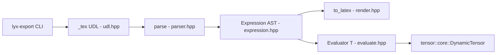

# `tensor::tex` — *the formula is the program*

| Metadata     | Value                                                          |
| ------------ | -------------------------------------------------------------- |
| Version      | 1.0.0                                                          |
| Status       | Implemented (Phase 1 MVP + Phase 1.5 Evaluator + Phase 1.5 LyX export module) |
| Type         | Module Detailed Design (Template 3 / arc42 §5 zoom-in)         |
| Owner        | uyuutosa                                                       |
| Source code  | [`include/tensor/tex/`](../../include/tensor/tex/), [`lyx-export/`](../../lyx-export/) |
| Related ADRs | [ADR-0005](../arc42/09-decisions/0005-adopt-tex-lyx-as-authoring-surface.md), [ADR-0009](../arc42/09-decisions/0009-adopt-ddd-ubiquitous-language-and-hexagonal-lite.md), [ADR-0015](../arc42/09-decisions/0015-aspire-to-canonical-reference-quality-not-self-anoint.md) (superseding [ADR-0013](../arc42/09-decisions/0013-reframe-as-canonical-reference-for-named-tensor-computation.md)) |
| Sibling      | [`tensor-core.md`](./tensor-core.md), [`tensor-autograd.md`](./tensor-autograd.md) |
| Last Updated | 2026-05-11                                                     |

## Revision history

| Version | Date       | Summary                                                        |
| ------- | ---------- | -------------------------------------------------------------- |
| 1.0.0   | 2026-05-11 | Initial Template-3 detailed design covering Phase 1 + Phase 1.5 shipped state. |

---

## TL;DR

`tensor::tex` is the project's **strongest differentiator**: a DrivingAdapter that accepts a LaTeX-subset string (via the `_tex` user-defined literal or `parse()` at runtime), parses it into an `Expression` AST, and lets an `Evaluator<T>` bind named tensors to indexed variables and evaluate the formula end-to-end into a `DynamicTensor<T>`. The slogan *the formula is the program* originates here: the same expression you'd write on the whiteboard or in a paper becomes the program. The Phase 1.5 LyX export module under [`lyx-export/`](../../lyx-export/) extends the surface to: write the formula in LyX, hit "File → Export → Tensor C++", get a `.cpp` file with the `_tex` UDL invocation pre-filled.

---

## 1. Context / Background

### 1.1 Why this module exists

[ADR-0005](../arc42/09-decisions/0005-adopt-tex-lyx-as-authoring-surface.md) committed to **TeX / LyX as the authoring surface** — i.e., the project takes the long-standing pedagogical promise of "the formula is the program" and operationalises it as a parser + evaluator that runs on top of `tensor::core`. The maintainer's prior framing — "昔の夢" (an old dream) — was the explicit driver: the 2016 named-axis library was already gesturing at this, but only the Phase 1.5 work (PRs #6, #25, #31) made the round-trip end-to-end.

The DrivingAdapter classification per [ADR-0009](../arc42/09-decisions/0009-adopt-ddd-ubiquitous-language-and-hexagonal-lite.md) is correct: `tensor::tex` *produces* expression graphs and bound tensors that `tensor::core` then evaluates. The Domain never depends on `tex`; removing the container leaves `core` and `autograd` compilable.

### 1.2 Technical problem

A parseable LaTeX subset for named-axis tensor algebra must answer three design questions:

1. **What subset of LaTeX is in scope?** The full LaTeX language is impossibly large. The educational pitch needs a subset that covers the math notation a learner would write: `a_i`, `b_{ij}`, `a_i + b_j`, `a_i * b_j`, `\sum_i x_i`, `\sum_{ij} a_{ij} b_{ij}`, `c_{ij} = a_i b_j` (equation form).
2. **When does parsing happen?** Compile-time (consteval, allocation-free, no runtime dispatch) or runtime (heap-allocated AST, mutable per-call)? Both is allowed by ADR-0005; runtime is shipped, consteval is the Phase 1.5+ upgrade tracked under impl-plans.
3. **How are tensor symbols bound to the AST?** The parser sees identifiers; the evaluator must know that `a` is a `DynamicTensor<double>` with axis `i` of extent 5. The `Evaluator<T>::bind(name, tensor)` API answers this; the bound state is per-Evaluator-instance (no global lookup).

### 1.3 Prerequisites / required knowledge

- [Einstein summation convention](https://en.wikipedia.org/wiki/Einstein_notation) — the math the parser implements.
- [C++20 user-defined literals](https://en.cppreference.com/w/cpp/language/user_literal) — how `R"(a_i + b_j)"_tex` becomes a call to `operator""_tex`.
- [`tensor::core`](./tensor-core.md) — the Domain types the evaluator produces.
- [LyX](https://www.lyx.org/) — for understanding the export module under `lyx-export/`. LyX is a WYSIWYG TeX editor; this project's export module translates its `\begin_inset Formula` blocks into the `_tex` UDL form.

---

## 2. Goals

- Parse a usable LaTeX subset (indexed variables, summation, addition / multiplication / division, equation `=`, grouping) into a navigable AST.
- Round-trip: `parse(to_latex(expr)) == expr` for every expression in the corpus. Property-tested.
- `Evaluator<T>` binds named tensors and evaluates the AST into `DynamicTensor<T>`, reproducing `tensor::core`'s broadcast and contraction semantics through the Einstein convention naturally encoded by the parsed labels.
- LyX export: a LyX user can write a tensor formula in WYSIWYG mode and export to a `.cpp` file with the `_tex` UDL invocation pre-filled and an `Evaluator::bind` skeleton.
- Stay a DrivingAdapter: the parser, AST, and Evaluator have one-way dependence on `tensor::core`.

---

## 3. Non-goals

- **Full LaTeX coverage.** No environments (\\begin{align}), no \\frac (only `/`), no decoration like \\dot{x}. The subset is what *Einstein-notation tensor algebra* needs; extending it is a research item, not a release goal.
- **TeX backend rendering.** This module produces `to_latex()` strings as text; producing PDFs from them is out of scope. LyX or a separate `latex` toolchain handles that.
- **General CAS / symbolic simplification.** No `a_i * 0 → 0` rewriting, no `(a + b) - b → a`. Optimisation is the consumer's job; the evaluator runs what it sees.
- **Compile-time evaluator.** The parser has a runtime variant (shipped) and a `consteval` variant (planned, Phase 1.5+). The Evaluator is runtime; `consteval` evaluator would need `consteval`-friendly tensor types — out of scope for this release.
- **LyX → arbitrary-language export.** Only `.cpp` output; Python / Julia exporters are not on the roadmap.

---

## 4. Proposed design (as shipped)

### 4.1 Architecture overview



All arrows point *out of* `tensor::core`'s Domain into `tensor::tex` or from `tensor::tex` *back* into the Domain via `Evaluator → DynamicTensor`. The Domain is unaware of the adapter.

### 4.2 Supported LaTeX subset

The parser accepts a context-free grammar approximated by:

```
equation        ::= expression '=' expression
expression      ::= term (('+' | '-') term)*
term            ::= factor (('*' | '/' | <juxtaposition>) factor)*
factor          ::= '-' factor | atom
atom            ::= indexed_var | sum | group | number
indexed_var     ::= identifier ('_' index)?
index           ::= identifier | '{' identifier+ '}'
sum             ::= '\sum' ('_' index)? expression
group           ::= '{' expression '}' | '(' expression ')'
identifier      ::= [a-zA-Z]+
number          ::= [0-9]+ ('.' [0-9]+)?
```

**Juxtaposition** is treated as multiplication: `a_i b_j` parses identically to `a_i * b_j`. This is the convention every textbook uses; the parser honors it. (The test sentinel for "trailing characters throw" in PR #6 had to switch from `garbage trailing` to `?` because juxtaposition would otherwise have absorbed the garbage as implicit multiplication.)

### 4.3 `Expression` AST (`expression.hpp`)

Five node variants encoded as a `std::variant`:

| Node | Carries | Produced by |
| ---- | ------- | ----------- |
| `IndexedVar` | `name`, `vector<label>` | identifier with optional `_i` / `_{ij}` |
| `BinOp` | `op` (`+`/`-`/`*`/`/`), `lhs`, `rhs` | binary operator productions |
| `Sum` | optional summation label set, body | `\sum_i ...` / `\sum_{ij} ...` |
| `Equation` | `lhs`, `rhs` | top-level `=` |
| `Group` | inner expression | `{...}` / `(...)` |

The AST is heap-allocated (`std::unique_ptr<Expression>` children) — required for the runtime parser; a `consteval` variant would replace with a flattened arena once the C++20 `constexpr` story for `std::unique_ptr` is fully landed in the compiler matrix.

### 4.4 `Evaluator<T>` (`evaluate.hpp`)

```cpp
template <class T>
class Evaluator {
public:
    using tensor_type = DynamicTensor<T>;

    Evaluator& bind(std::string name, tensor_type value);
    tensor_type evaluate(Expression const& expr);

private:
    std::unordered_map<std::string, tensor_type> bindings_;
};
```

The evaluator handles each node by type:

- **`IndexedVar{name, labels}`** — looks up `bindings_[name]`, then re-labels the tensor's axes to match the indexed labels. (If the binding's axis labels already match, this is a no-op; otherwise it's a rename — an axis-label rebinding, not a transpose.)
- **`BinOp{op, lhs, rhs}`** — evaluates each side, then calls the corresponding `tensor::core::ops` function. Broadcast happens transparently because the labels carry through from the leaves.
- **`Sum{labels, body}`** — evaluates `body`, then calls `tensor::core::reduce_along_labels(result, labels)` to collapse the named axes.
- **`Equation{lhs, rhs}`** — evaluates `rhs` and discards `lhs`. The LHS is symbolic; the test corpus uses it for readability but the evaluator only needs RHS.
- **`Group{inner}`** — evaluates `inner`. Grouping is parser-only; the AST preserves the node for round-trip rendering but evaluation is transparent.

**End-to-end test**: `R"(c_{ij} = a_i b_j)"_tex` bound with `a = [1, 2, 3, 4, 5]` and `b = [10, 20, 30, 40, 50]` produces the 5×5 outer-sum tensor matching the 2016 README's table 5 byte-for-byte ([§10 QO-3](../arc42/10-quality/overview.md)).

### 4.5 `to_latex` (`render.hpp`)

Walks the `Expression` AST and emits a LaTeX string. The round-trip property `parse(to_latex(e)) == e` is property-tested on a corpus of ~10 expressions covering each AST node type. This is the canonical correctness witness for the parser/renderer pair.

### 4.6 `_tex` UDL (`udl.hpp`)

```cpp
inline auto operator""_tex(char const* src, std::size_t n) {
    return tensor::tex::parse(std::string_view{src, n});
}
```

Runtime in MVP; the planned upgrade is `consteval` — see [ADR-0005](../arc42/09-decisions/0005-adopt-tex-lyx-as-authoring-surface.md). The runtime form has its limits visible (no compile-time type-checking of indices) but trades them for `Expression` flexibility.

### 4.7 LyX export module (`lyx-export/`)

PR #31 shipped this as a Phase 2 sub-deliverable of ADR-0005. Components:

- **`lyx_to_tex.py`** — Python CLI translator: parses a `.lyx` file, finds every `\begin_inset Formula` block, emits the `_tex` UDL invocation surrounded by `Evaluator<T>::bind` skeleton calls.
- **`install_lyx_converter.sh`** — appends `\format` and `\converter` lines to the user's LyX `preferences` file, registering a "Tensor C++" output target. After this, the user goes File → Export → Tensor C++.
- **`tensor-math.module`** — LyX Module declaring a custom inset `Flex:TensorMath` for tensor-bearing math (optional; semantically tags math as tensor algebra).
- **`example.lyx`** + **`example.cpp.expected`** — golden-file round-trip; the test asserts `lyx_to_tex.py example.lyx == example.cpp.expected`.

This makes the *the formula is the program* claim audible to LyX-using authors: write your paper, then `make` produces a runnable `.cpp`. The Phase 4 release rehearsal (#48) names this as a canonical differentiator the launch post (discussion-points Axis A) should highlight.

---

## 5. Alternatives considered

### 5.1 `consteval` parser only (no runtime variant)

The original ADR-0005 framing aimed at consteval-first. Rejected for the MVP because: (a) compiler matrix at the project's C++20 baseline ([TC-1](../arc42/02-architecture-constraints/overview.md)) has uneven `consteval` quality at the depth required for a recursive-descent parser; (b) the runtime variant supports user-supplied formula strings (e.g. interactive Jupyter cells) that consteval would forbid. Outcome: runtime now, consteval as a Phase 1.5+ follow-up.

### 5.2 ANTLR / Boost.Spirit-based parser

Existing parser generators would produce a more rigorous grammar but at the cost of a build-system dependency and a learning curve for contributors. Rejected because: (a) hand-written recursive descent fits in ~300 lines and is legible; (b) the LaTeX subset is small enough that a generator buys nothing; (c) canonical-reference framing prefers code a reader can step through to a black-box generated parser.

### 5.3 SymPy / Mathematica-style symbolic engine

A more complete CAS would support algebraic simplification, differentiation symbolically, etc. Rejected because: (a) symbolic differentiation is `tensor::autograd`'s job, done numerically on a tape; (b) the project's pedagogy is to keep `tex` as an authoring layer, not a math engine.

### 5.4 LyX export to Python instead of C++

Could output a `numpy.einsum` invocation. Rejected because: (a) the project is a C++ library; (b) the differentiator is that the *same* expression compiles into C++ with all its type-safety, not that it runs in Python. The LyX → Python path could exist as a separate community contribution but is not in scope.

---

## 6. Testing strategy

| Test file | Surface |
| --------- | ------- |
| [`tests/test_tex_parser.cpp`](../../tests/test_tex_parser.cpp) | `parse` correctness on a 10-expression corpus; round-trip `parse(to_latex(e)) == e`. |
| [`tests/test_tex_evaluate.cpp`](../../tests/test_tex_evaluate.cpp) | `Evaluator<T>::bind` + `evaluate` end-to-end; reproduces 2016 README's 5×5 outer sum and the `\sum_i {c_i d_i}` inner product = 32. |
| [`tests/test_function_reference_tensors.cpp`](../../tests/test_function_reference_tensors.cpp) | Indirect: ensures the 2016 README's `a * f` and `r * 3` outputs match — `tex` is the consumer of these tensor types via formula evaluation. |
| [`lyx-export/example.cpp.expected`](../../lyx-export/example.cpp.expected) | Golden-file LyX → C++ translator round-trip. CI doesn't run this yet (manual gate); a follow-up PR adds it. |

The 10-job CI matrix executes the C++ tests on every PR.

---

## 7. Cross-references

- arc42 §5 (where this container is named, classified DrivingAdapter): [`../arc42/05-building-blocks/overview.md`](../arc42/05-building-blocks/overview.md)
- §6 runtime scenario 2 (`_tex` end-to-end walk-through): [`../arc42/06-runtime/overview.md`](../arc42/06-runtime/overview.md)
- §10 (quality scenario QO-3 — byte-for-byte 2016 README replication is exercised through this module): [`../arc42/10-quality/overview.md`](../arc42/10-quality/overview.md)
- §12 (vocabulary): [`../arc42/12-glossary/overview.md`](../arc42/12-glossary/overview.md) — `_tex` UDL, Expression, Evaluator
- ADRs anchored: [ADR-0005](../arc42/09-decisions/0005-adopt-tex-lyx-as-authoring-surface.md), [ADR-0009](../arc42/09-decisions/0009-adopt-ddd-ubiquitous-language-and-hexagonal-lite.md), [ADR-0013](../arc42/09-decisions/0013-reframe-as-canonical-reference-for-named-tensor-computation.md)
- Sibling detailed designs: [`./tensor-core.md`](./tensor-core.md), [`./tensor-autograd.md`](./tensor-autograd.md), [`./webgpu-element-wise-kernels.md`](./webgpu-element-wise-kernels.md), [`./webgpu-gemm-kernel.md`](./webgpu-gemm-kernel.md). Planned: `./kernel-backend-port.md`.
- LyX integration: [`lyx-export/README.md`](../../lyx-export/README.md), [`lyx-export/LYX_PLUGIN.md`](../../lyx-export/LYX_PLUGIN.md)
- Original maintainer driver: [2016 Qiita blog post on named-axis convolutions](http://qiita.com/uyuutosa/items/12e87f4695bd151b1d74)
