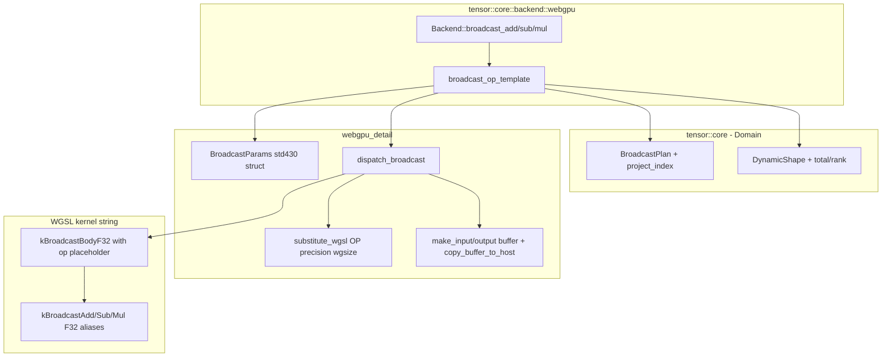

# `webgpu::Backend` broadcast kernels (P3.M5) — detailed design

| Metadata     | Value                                                          |
| ------------ | -------------------------------------------------------------- |
| Version      | 1.0.0                                                          |
| Status       | Implemented (P3.M5 shipped via PR #62; RTX 3090 verified).      |
| Type         | Module Detailed Design (Template 3 / arc42 §5 zoom-in)          |
| Owner        | uyuutosa                                                       |
| Source code  | [`include/tensor/core/backend/webgpu_wgsl.hpp::kBroadcast{Add,Sub,Mul}F32`](../../include/tensor/core/backend/webgpu_wgsl.hpp), [`webgpu_detail/dispatch.hpp::{BroadcastParams,dispatch_broadcast}`](../../include/tensor/core/backend/webgpu_detail/dispatch.hpp), [`webgpu.hpp::broadcast_op`](../../include/tensor/core/backend/webgpu.hpp) |
| Related ADRs | [ADR-0006](../arc42/09-decisions/0006-adopt-webgpu-as-gpu-backend.md), [ADR-0011](../arc42/09-decisions/0011-kernel-backend-port-api.md), [ADR-0012](../arc42/09-decisions/0012-webgpu-adapter-implementation-design.md), [ADR-0014](../arc42/09-decisions/0014-external-substrate-strategy.md), [ADR-0016](../arc42/09-decisions/0016-substrate-refinement-drop-gpu-cpp-talk-to-dawn-directly.md) |
| Related plan | [Phase 3 impl-plan addendum — P3.M5](../impl-plans/2026-05-11_phase-3-webgpu.md) |
| Sibling designs | [`./webgpu-element-wise-kernels.md`](./webgpu-element-wise-kernels.md) (P3.M3), [`./webgpu-gemm-kernel.md`](./webgpu-gemm-kernel.md) (P3.M4) |
| Last Updated | 2026-05-12                                                     |

## Revision history

| Version | Date       | Summary                                                        |
| ------- | ---------- | -------------------------------------------------------------- |
| 1.0.0   | 2026-05-12 | Initial Template-3 design covering the shipped P3.M5 broadcast adapter on the WebGPU backend. Trio with the element-wise + GEMM designs. |

---

## TL;DR

The WebGPU adapter implements the **Einstein-style label-aware broadcast** (`a_i + b_j → c_{ij}`) as a single WGSL kernel template (`kBroadcastBodyF32`) parameterised by the operator (`+` / `-` / `*`) at dispatch time. The kernel consumes a `BroadcastParams` storage buffer encoding result / A / B ranks, extents, and source-axis maps with a sentinel for "absent on this side". Max rank 8. The dispatcher (`dispatch_broadcast`) handles compile → bind → dispatch → wait, just like the element-wise and GEMM helpers but with one extra storage binding for `Params`. **Shipped in PR #62 and verified on RTX 3090** — outer-product (1D + 1D → 2D) and label-aligned (rank-2 + rank-1 → rank-2) cases agree with `reference::Backend` within `1e-5` for `float`.

---

## 1. Context / Background

### 1.1 Why this module exists

The `KernelBackend` port (ADR-0011) names `broadcast_add` / `broadcast_sub` / `broadcast_mul` as three of its fifteen methods. They are the GPU equivalent of the Einstein broadcast that `tensor::core::broadcast.hpp` defines: two tensors `a_{labels_a}` and `b_{labels_b}` combine into `c_{labels_a ∪ labels_b}` (set union of axis labels, with shared labels aligned). This is what makes named-axis algebra interesting — `a_i + b_j` produces a 2-D table without the user writing any explicit outer-product code.

Phase 3 P3.M5 ships the WebGPU side. After it, 12 of 15 `KernelBackend` methods on the WebGPU adapter dispatch real Dawn compute for `float`; only `reduce_sum`, `unbroadcast`, and the non-simple-GEMM `contract` cases continue to delegate to reference (matching the Eigen adapter's scope).

### 1.2 Technical problem

Three design questions specific to GPU broadcast:

1. **How is the BroadcastPlan moved to the GPU?** The plan is a `DynamicShape` plus two `std::vector<std::size_t>` source maps with a `broadcast_npos` sentinel for "absent". The kernel needs the same information per-thread to project a result-flat-index back to A and B indices.
2. **What's the kernel layout?** One kernel per operator (×3) vs one templated kernel with operator substitution at dispatch time (×1)? The element-wise kernels chose ×4 separate constants for legibility; broadcast chose ×1 template because the body is meaningfully larger (delinearise + project + linearise + compute) and triplicating it would be noise.
3. **Which buffer kind for the Params?** Uniform buffers in WGSL use std140-like rules that pad `u32` array elements to 16-byte stride; the C++ struct does not. Storage (std430) packs tightly. Storage is the correct choice.

The implementation is the answer to all three: one templated WGSL string with `{{op}}` placeholder; `BroadcastParams` in a storage buffer; the operator substituted at dispatch time by `detail::dispatch_broadcast`.

### 1.3 Prerequisites / required knowledge

- [Einstein summation convention](https://en.wikipedia.org/wiki/Einstein_notation) — the algebraic model.
- [`tensor::core::broadcast.hpp`](../../include/tensor/core/broadcast.hpp) — `BroadcastPlan`, `broadcast_shapes`, `project_index`, `unbroadcast`. The detail at the C++ level mirrors the kernel's per-thread logic.
- WGSL std140 vs std430 buffer layout rules — the relevant detail is in the [WebGPU shading-language spec](https://www.w3.org/TR/WGSL/#address-spaces). Uniform = std140-like; storage = std430-like.
- arc42 [§5 Building Blocks](../arc42/05-building-blocks/overview.md) and the sibling designs ([`./webgpu-element-wise-kernels.md`](./webgpu-element-wise-kernels.md), [`./webgpu-gemm-kernel.md`](./webgpu-gemm-kernel.md)).

---

## 2. Goals

- Implement `broadcast_add` / `broadcast_sub` / `broadcast_mul` on `webgpu::Backend` so the same Einstein-style broadcast that `tensor::core::ops` performs on CPU runs on the GPU for `float`.
- Honor the `KernelBackend` port surface (`BroadcastPlan` as the carrier of axis-source maps + result shape) without inventing a parallel representation.
- One readable WGSL template covers all three operators — ADR-0013's "one readable kernel over several specialised" stance.
- Max rank 8 (the project's tests / tutorials use rank ≤ 3 in practice).
- Cross-validated against `reference::Backend` within ADR-0012's `1e-5` tolerance for `float`.

---

## 3. Non-goals

- **`reduce_sum` and `unbroadcast` on GPU.** Out of scope for P3.M5; continue to delegate to reference. A scalar reduction over a small-to-moderate tensor is dominated by host↔device round-trip; scatter-add (unbroadcast) needs atomicAdd-on-float patterns that don't fit ADR-0013's single-readable-kernel framing. Revisit in Phase 4+ if a profile-driven need emerges.
- **Higher-rank than 8.** A future contributor can bump `kBroadcastMaxRank`; for now 8 is generous.
- **Non-float dtypes on the GPU.** Per ADR-0012 § f32-only MVP, double / int / half delegate to reference. The `broadcast_op` template helper in `webgpu.hpp` does the `if constexpr (!std::is_same_v<T, float>)` short-circuit at compile time.
- **Per-operator specialised kernels.** A profile-driven future change could split the template into three (skipping the `{{op}}` substitution); not done now because legibility wins.
- **Fused expressions** like `broadcast_madd(a, b, c)` = `a*b + c` on the GPU. Phase 4+ if profitable; per-call kernels stay one operation each for now.

---

## 4. Proposed design (as shipped)

### 4.1 Architecture overview



### 4.2 The WGSL kernel template (`kBroadcastBodyF32`)

The shipped source ([`webgpu_wgsl.hpp::detail_wgsl::kBroadcastBodyF32`](../../include/tensor/core/backend/webgpu_wgsl.hpp)) implements the algorithm:

```text
for thread i = global_invocation_id.x:
    if i >= arrayLength(&out): return
    result_idx = delinearise(i, result_extents, result_rank)        // row-major
    a_idx[r]   = result_idx[a_source[r]] if a_source[r] != NPOS    (else 0)
    b_idx[r]   = result_idx[b_source[r]] if b_source[r] != NPOS    (else 0)
    a_flat     = linearise(a_idx, a_extents, a_rank)                // row-major
    b_flat     = linearise(b_idx, b_extents, b_rank)
    out[i]     = a[a_flat] <op> b[b_flat]
```

The `{{op}}` placeholder is substituted by `dispatch_broadcast` at dispatch time to one of `+` / `-` / `*`. Two other placeholders (`{{precision}}` / `{{workgroupSize}}`) are the standard set shared with the element-wise kernels.

Three operator-named aliases — `kBroadcastAddF32`, `kBroadcastSubF32`, `kBroadcastMulF32` — all point at the same template constant; the dispatcher does the per-call substitution. This is the "one readable kernel" stance from ADR-0013: the template is read once; the three operators are textual configurations of it.

The maximum supported rank is exposed as `kBroadcastMaxRank` (= 8). The kernel statically allocates `array<u32, 8>` for `result_idx` / `a_idx` / `b_idx` and walks only `result_rank` / `a_rank` / `b_rank` elements per call.

### 4.3 The `BroadcastParams` storage buffer

```cpp
// in webgpu_detail/dispatch.hpp
struct BroadcastParams {
    std::uint32_t result_rank;     // 0..8
    std::uint32_t a_rank;
    std::uint32_t b_rank;
    std::uint32_t padding;
    std::uint32_t result_extents[8];
    std::uint32_t a_extents[8];
    std::uint32_t b_extents[8];
    std::uint32_t a_source[8];     // 0xFFFFFFFF = npos
    std::uint32_t b_source[8];
};                                  // total 176 bytes
```

Mirrors the WGSL declaration. Three layout-relevant notes:

1. **Storage, not uniform.** WGSL uniform buffers force `array<u32, N>` to use a 16-byte stride per element (std140-like); the storage address space uses tight `4`-byte stride (std430-like). Our C++ struct packs `u32` arrays tightly, so storage is the correct choice. Discovered the hard way during dev — see [discovery report excerpt below](#41-discovery-the-rank-vs-element-count-bug-and-the-storage-vs-uniform-bug).
2. **`padding: u32` at offset 12.** Keeps the first array (`result_extents`) at offset 16. Member name `padding` rather than `_pad` because while WGSL spec allows leading-underscore identifiers in most contexts, conservative naming avoids any compiler-specific edge case.
3. **`0xFFFFFFFF` as the npos sentinel.** Matches the WGSL constant `NPOS : u32 = 0xFFFFFFFFu` in the kernel. The C++ side maps `broadcast_npos` (`= std::size_t(-1)`) to this when packing the source maps.

#### 4.3.1 Discovery: the rank-vs-element-count bug and the storage-vs-uniform bug

During implementation of `broadcast_op<T>`, two bugs surfaced in quick succession, both with the same symptom (output buffer reads as all zeros except for indices 0 and 1):

- **Storage-vs-uniform**: initially the Params buffer was Uniform. WGSL's std140-like rules force `array<u32, 8>` to use a 16-byte stride per element — so the kernel reads `p.result_extents[1]` from an offset 16 bytes after `result_extents[0]`, not 4 bytes. The C++ struct uses tight packing. The kernel got garbage for everything past the first element of the first array. Fix: switch the binding to a Storage buffer (`ReadOnlyStorage` binding type), which uses std430 tight packing matching the C++ side.
- **Rank-vs-element-count**: `DynamicShape::size()` returns the rank (number of axes), not the element count. The first-cut C++ wrapper used `plan.result.size()` to size the output buffer and was getting `2` (rank for a 4×3 result) instead of `12` (total elements). The kernel's `arrayLength(&out)` then reported 2, so only threads 0–1 ran. Fix: use `plan.result.total()`.

Both bugs were caught at the first local run on RTX 3090. The canonical-reference reproducibility discipline (ADR-0015) made this easy: build it, run it, see what comes back. The fixes are documented in PR #62.

### 4.4 The `dispatch_broadcast` helper

```cpp
// in webgpu_detail/dispatch.hpp
inline void dispatch_broadcast(
    WebGPUContext& ctx,
    std::string_view wgsl_template,    // = kBroadcastBodyF32
    std::string_view op_token,         // "+" / "-" / "*"
    wgpu::Buffer const& gA, std::size_t a_bytes,
    wgpu::Buffer const& gB, std::size_t b_bytes,
    wgpu::Buffer const& gOut, std::size_t out_bytes,
    BroadcastParams const& params,
    std::size_t result_total,
    std::size_t workgroup_size);
```

Sequence (per [`./webgpu-element-wise-kernels.md` §3](./webgpu-element-wise-kernels.md) for the shared shape):

1. `substitute_wgsl` replaces `{{precision}}`, `{{workgroupSize}}`, `{{op}}` in the template.
2. `Device::CreateShaderModule` compiles the resulting WGSL into a `wgpu::ShaderModule`.
3. Create a Storage buffer for `BroadcastParams`, `Queue::WriteBuffer` the host struct.
4. 4-binding `BindGroupLayout` — bindings 0/1 = ReadOnlyStorage (a, b), binding 2 = Storage (out), binding 3 = ReadOnlyStorage (params).
5. Build the pipeline, bind group, encode + dispatch with `groups = ceil(result_total / workgroup_size)`.
6. Submit + `OnSubmittedWorkDone` wait via `pump_until` (the same `wgpu::CallbackMode::AllowProcessEvents` pattern as the other helpers).

### 4.5 The `broadcast_op<T>` template helper

In `webgpu.hpp`, the three operator methods share one template:

```cpp
template <class T, class RefFn>
DynamicTensor<T> broadcast_op(DynamicTensor<T> const& a,
                              DynamicTensor<T> const& b,
                              BroadcastPlan const& plan,
                              std::string_view wgsl_template,
                              std::string_view op_token,
                              RefFn ref_method) const {
    if constexpr (!std::is_same_v<T, float>) {
        return (ref_.*ref_method)(a, b, plan);  // f32-only MVP per ADR-0012
    } else {
        if (plan.result.rank() > kBroadcastMaxRank ||
            a.shape().rank() > kBroadcastMaxRank ||
            b.shape().rank() > kBroadcastMaxRank) {
            return (ref_.*ref_method)(a, b, plan);  // over-rank delegate
        }
        // Pack BroadcastParams from the plan + shapes
        // Allocate gA / gB / gOut, upload
        // detail::dispatch_broadcast(...)
        // detail::copy_buffer_to_host(...) into result
        // return result
    }
}
```

The three public methods (`broadcast_add` / `broadcast_sub` / `broadcast_mul`) are one-liners that call `broadcast_op` with the operator-specific WGSL alias and `{{op}}` token.

---

## 5. Alternatives considered

### 5.1 Three separate WGSL kernels (one per operator)

The element-wise design ships four separate constants (`kAddF32` / `kSubF32` / `kMulF32` / `kDivF32`) for the four binary operators. The broadcast design picked one templated kernel with `{{op}}` substitution.

Why the difference: the element-wise body is a single line (`out[i] = a[i] <op> b[i]`); triplicating it adds no cognitive load. The broadcast body is ~40 lines of delinearise / project / linearise / compute; triplicating it would create three almost-identical 40-line blocks, and any future change would have to be made in three places. The canonical-reference discipline (ADR-0013) is about *legibility*; in this case the templated form is more legible because there's only one place to read the algorithm.

### 5.2 Pack `BroadcastParams` into a single packed `array<vec4<u32>>` in a uniform buffer

A way to make Uniform work despite std140's 16-byte stride: pack the u32 arrays into `array<vec4<u32>, 2>` so each `vec4` is naturally 16-byte aligned. Rejected because: (a) the WGSL becomes less legible (`p.result_extents[k / 4][k % 4]`); (b) Storage buffer is equally efficient on Dawn and has tight packing rules that match C++; (c) the 176-byte buffer easily fits in storage.

### 5.3 Pass `BroadcastPlan` as multiple separate storage buffers

Instead of one 176-byte struct, ship five storage buffers (`extents` ×3, `sources` ×2). Rejected because it inflates the bind-group surface from 4 to 8 bindings without making the kernel any clearer, and adds buffer-allocation overhead per call.

### 5.4 Run reduce / unbroadcast on the GPU too

Considered. Rejected for P3.M5:

- **`reduce_sum`**: a scalar reduction on a small-to-moderate tensor is dominated by the ~20 ms host↔device round-trip overhead. CPU reduction over 100k floats takes ~50 μs on a modern laptop; the GPU version would take 20+ ms by the time the data round-trips. Worth doing only when the tensor is huge AND already on the GPU (which Phase 5+ would address by keeping GPU buffers in-place).
- **`unbroadcast`**: scatter-add requires `atomicAdd`-on-float patterns. WGSL supports `atomicAdd` only on `atomic<i32>` / `atomic<u32>` storage; for float you'd bit-cast through `u32` with a CAS loop, which is verbose and slow. Doesn't fit the canonical-reference "one readable kernel" framing. Possible Phase 4+ work; for now reference handles it correctly.

---

## 6. Testing strategy

### 6.1 Cross-validation against reference (`tests/test_webgpu_backend.cpp`)

| Test | Shape | Operators | Assertions |
| ---- | ----- | --------- | ---------- |
| `broadcast_add on f32 outer product` | (4) + (3) → (4, 3) = 12 elements | add | 12 + REQUIRE = 14 |
| `broadcast {add,sub,mul} on f32 with overlapping label` | (3, 4) + (4) → (3, 4) = 12 elements × 3 ops | add / sub / mul | 36 + REQUIRE = 38 |

Tolerance: `1e-5` per [ADR-0012 §Decision Outcome point 5](../arc42/09-decisions/0012-webgpu-adapter-implementation-design.md). All assertions pass on the RTX 3090.

### 6.2 What's NOT tested

- Higher rank (5-8). The kernel is dimensionally generic but the project's tests don't exercise it. A `tutorials/` follow-up that demonstrates rank-4 broadcast would naturally extend coverage.
- Non-float fallback (`double`, `int`). The `if constexpr` short-circuit means the GPU path isn't taken for these types; reference is the source of truth. Cross-checked indirectly because the existing `double` tests (which use the same `webgpu::Backend` instance) pass.

---

## 7. Cross-references

- arc42 §5 building blocks (where the WebGPU adapter is named): [`../arc42/05-building-blocks/overview.md`](../arc42/05-building-blocks/overview.md)
- §6 runtime scenario 1 (`c = a + b` via broadcast — CPU walk-through that the GPU mirrors): [`../arc42/06-runtime/overview.md`](../arc42/06-runtime/overview.md)
- §10 quality scenario QO-1 (numerical agreement across backends — the cross-validation tolerance): [`../arc42/10-quality/overview.md`](../arc42/10-quality/overview.md)
- §12 glossary entries: [`Broadcast (Einstein-style)`, `KernelBackend`](../arc42/12-glossary/overview.md)
- ADRs anchored: [ADR-0011](../arc42/09-decisions/0011-kernel-backend-port-api.md), [ADR-0012](../arc42/09-decisions/0012-webgpu-adapter-implementation-design.md), [ADR-0016](../arc42/09-decisions/0016-substrate-refinement-drop-gpu-cpp-talk-to-dawn-directly.md)
- Sibling detailed designs: [`./webgpu-element-wise-kernels.md`](./webgpu-element-wise-kernels.md), [`./webgpu-gemm-kernel.md`](./webgpu-gemm-kernel.md). Planned: `./kernel-backend-port.md` is the only remaining detailed-design slot.
- C++ broadcast Domain: [`include/tensor/core/broadcast.hpp`](../../include/tensor/core/broadcast.hpp) — the kernel's per-thread logic mirrors `project_index` + `increment_index` from this header.
- Shipping PR: [#62](https://github.com/uyuutosa/tensor/pull/62).
