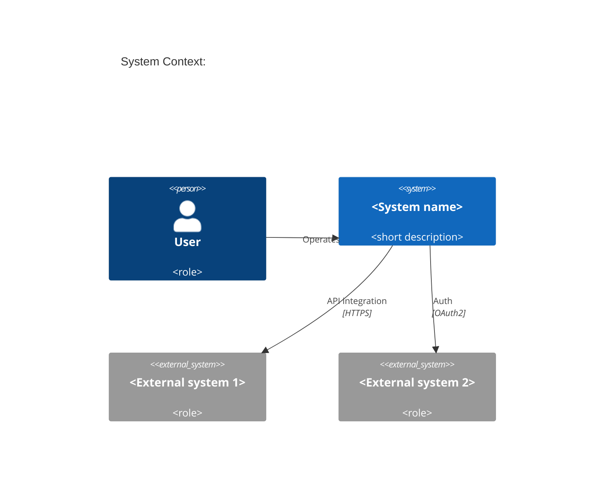
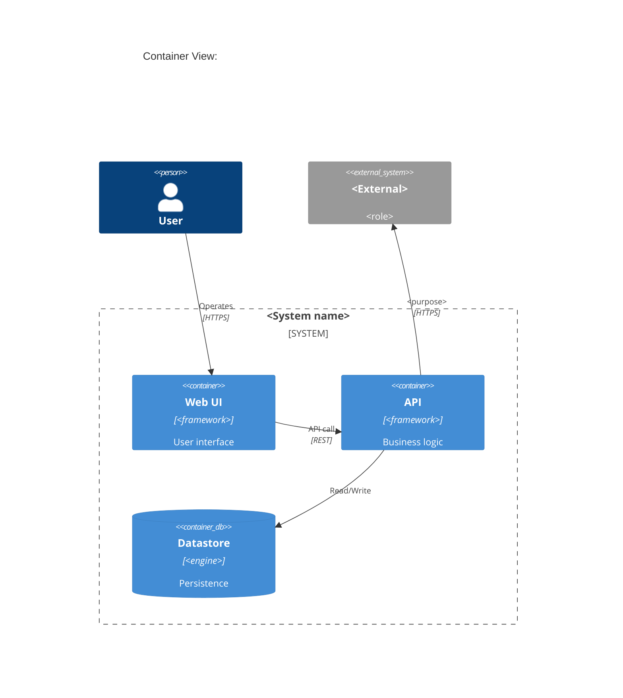

# Architecture Overview Template (Type 1)

> **Copy to use**: `cp templates/1_architecture-overview.md <target-dir>/<title>.md`
> Recommended location: `arc42/01-introduction-and-goals/overview.md` (top-level) or `arc42/08-crosscutting/<concern>.md`
> Reference: [arc42 §1+§3+§4+§5+§8](https://arc42.org/overview) + [C4 Model Level 1+2](https://c4model.com/)
> Length target: **8–15 pages** (single 10k-character monoliths are an industry anti-pattern)
>
> Delete this `> ...` guidance block after copying.

---

# <Title>

| Metadata     | Value                                                  |
| ------------ | ------------------------------------------------------ |
| Status       | Living document (continuously updated)                 |
| Type         | Architecture Overview (Type 1 / arc42 §1+§3+§5+§8)     |
| Owner        | Architect or Tech Lead                                 |
| Source code  | (if any)                                               |
| Last Updated | YYYY-MM-DD                                             |
| Related      | (related PRDs / ADRs / detailed designs)               |

## Revision history

| Version | Date       | Summary       |
| ------- | ---------- | ------------- |
| 1.0.0   | YYYY-MM-DD | Initial draft |

---

## TL;DR

<!-- 3–5 sentences to convey the conclusion. The reader should grasp the whole picture in 30 seconds.
Pattern: "This system <does X> in order to <Y>, implemented in <Z>.
The most important design decision is <B> over <A>, because <C>." -->

---

## 1. Introduction & Goals (arc42 §1)

### 1.1 Key requirements

<!-- 5–10 requirements that this system / module must satisfy and that influence architectural decisions. -->

### 1.2 Quality Goals (measurable, 5–6 items)

| #    | Quality attribute | Scenario                                      | Target          |
| ---- | ----------------- | --------------------------------------------- | --------------- |
| QG-1 | Performance       | API p95 latency                               | < 1 s           |
| QG-2 | Availability      | Monthly SLO                                   | 99.5%           |
| QG-3 | Security          | PII masking                                   | 100% coverage   |
| QG-4 | Extensibility     | Cost to add a new module                      | < 1 SP          |
| QG-5 | Maintainability   | New joiner to first commit                   | < 3 days        |

### 1.3 Stakeholders

| Role        | Primary concerns                          | Engagement depth   |
| ----------- | ----------------------------------------- | ------------------ |
| PO          | Functionality, schedule, cost             | All phases         |
| Dev team    | Implementability, maintainability         | All phases         |
| Operations  | Availability, observability               | Post-deploy        |
| Security    | AuthN/AuthZ, PII                          | Design review      |
| Client      | Functionality, SLA                        | Acceptance         |

---

## 2. Constraints (arc42 §2 — keep brief)

<!-- Technical, organisational, and regulatory constraints. Record only what is fixed and cannot be changed. -->

- Technical: <e.g. Cloud provider X / framework Y mandated>
- Organisational: <e.g. PoC scale of 5 engineers / 1-week sprints>
- Regulatory: <e.g. data-residency requirements / internal policies>

---

## 3. Context & Scope (arc42 §3 + C4 Level 1)

### 3.1 System Context diagram (C4 Level 1)

<!-- Describe the diagram in prose as well; LLM readers cannot always parse diagrams directly. -->

**System boundary**: <System name> provides <main function>. It pulls <data> from <external1> and authenticates via <external2>.

### 3.2 External dependencies

| External system | Purpose   | Protocol         | Failure mode                       |
| --------------- | --------- | ---------------- | ---------------------------------- |
| <name>          | <purpose> | <REST/gRPC/SSE>  | <fallback / retry / degraded>      |

---

## 4. Solution Strategy (arc42 §4)

<!-- A bulleted summary of the "five most important design decisions"; link each to its ADR. -->

| #   | Decision                                | Related ADR                                                  |
| --- | --------------------------------------- | ------------------------------------------------------------ |
| 1   | <e.g. Adopt framework X>                | [ADR-0001](../arc42/09-decisions/0001-<placeholder>.md)      |
| 2   | <e.g. Direct streaming over polling>    | [ADR-0002](../arc42/09-decisions/0002-<placeholder>.md)      |

---

## 5. Building Block View (arc42 §5 + C4 Level 2-3)

### 5.1 Container diagram (C4 Level 2)

### 5.2 Container responsibilities

| Container | Tech                | Responsibility                       | Main dependencies |
| --------- | ------------------- | ------------------------------------ | ----------------- |
| Web UI    | <framework>         | UI rendering                         | API               |
| API       | <framework>         | Business logic                       | Datastore / external |
| Datastore | <engine>            | Persistence                          | -                 |

---

## 6. Crosscutting Concepts (arc42 §8 — index of cross-cutting chapters)

<!-- Delegate detail to files under arc42/08-crosscutting/. Here, list which concerns are addressed and link out. -->

| Concern                  | Detail document                                                                                  |
| ------------------------ | ------------------------------------------------------------------------------------------------ |
| Error handling strategy  | [arc42/08-crosscutting/error-strategy.md](../arc42/08-crosscutting/error-strategy.md)            |
| AuthN/AuthZ / PII        | [arc42/08-crosscutting/auth-and-pii.md](../arc42/08-crosscutting/auth-and-pii.md)                |
| State management         | [arc42/08-crosscutting/state-management.md](../arc42/08-crosscutting/state-management.md)        |
| Observability / logging  | [arc42/08-crosscutting/observability.md](../arc42/08-crosscutting/observability.md)              |
| Performance / scalability| [arc42/08-crosscutting/performance.md](../arc42/08-crosscutting/performance.md)                  |

---

## 7. Quality Requirements (arc42 §10 — measurable scenarios)

<!-- Concretize each item from §1.2 Quality Goals into a measurable scenario. -->

| Quality attribute | Scenario                          | Target          | Verification         |
| ----------------- | --------------------------------- | --------------- | -------------------- |
| Performance       | Request → first response          | p95 < 1 s       | E2E benchmark        |
| Availability      | Monthly uptime                    | 99.5%           | Provider SLA monitor |

---

## 8. ADR index (reference to arc42 §9)

| ADR                                                          | Title    | Status    | Date       |
| ------------------------------------------------------------ | -------- | --------- | ---------- |
| [ADR-0001](../arc42/09-decisions/0001-<placeholder>.md)      | <Title>  | Accepted  | YYYY-MM-DD |

---

## 9. Risks & Tech Debt (arc42 §11 — keep brief)

| Risk    | Impact        | Mitigation                       |
| ------- | ------------- | -------------------------------- |
| <risk>  | High/Med/Low  | <plan or related ticket id>      |

---

## 10. Glossary (arc42 §12)

| Term    | Definition    | Reference  |
| ------- | ------------- | ---------- |
| <term>  | <definition>  | <link>     |

---

## 11. Related documents

- Internal links (vertical detailed designs)
- External links (official docs, academic papers, etc.) — provide generously so newcomers can dig deeper
