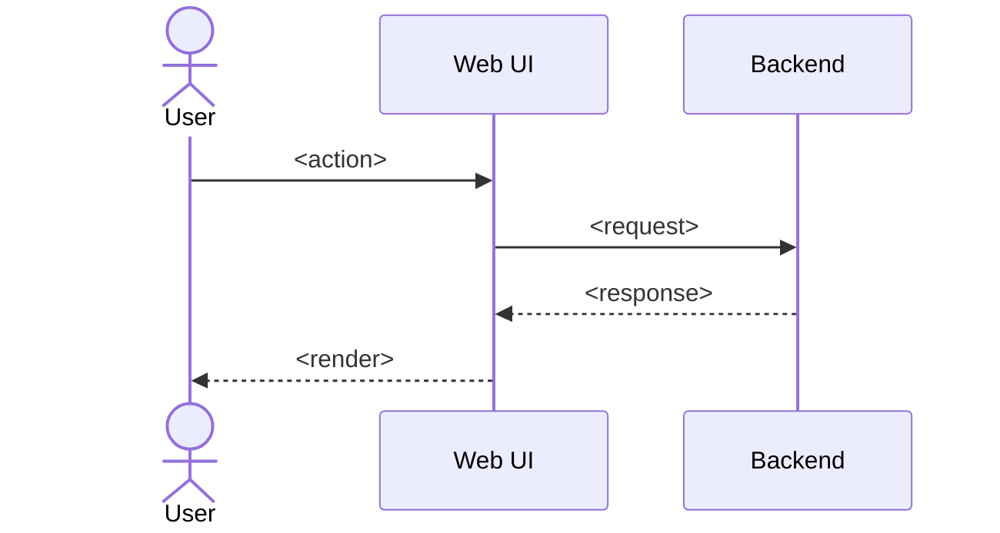

# PRD Template (Type 2 / Variant: FR-NN · NFR-NN numbering)

> **Copy to use**: `cp templates/2_prd.md <target-dir>/<feature-name>_PRD.md`
> Recommended location: `arc42/03-context-and-scope/prds/`
> Reference: [Lenny Rachitsky PRD](https://www.lennysnewsletter.com/p/how-the-most-successful-pms-write) + [Atlassian PRD](https://www.atlassian.com/agile/product-management/requirements) + [GitLab Handbook PRD](https://handbook.gitlab.com/handbook/product/product-processes/) + [Marty Cagan SVPG](https://www.svpg.com/)
> Length target: **3–10 pages**
>
> **This template adopts the "numbered" variant**: it carries **FR-NN (functional requirements)** and **NFR-NN (non-functional requirements)** identifiers inline. When an enterprise customer requests an FRD-style deliverable, §5 + §6 can be extracted directly to satisfy the request.
> The IDs follow the AWS Well-Architected `SEC01-BP01` style as stable references that PRs and tickets can cite.
>
> Delete this `> ...` guidance block after copying.

---

# PRD: <Feature name>

| Metadata            | Value                                                      |
| ------------------- | ---------------------------------------------------------- |
| Status              | Draft / Review / Approved / Implemented                    |
| Type                | PRD (Product Requirement Document / Type 2)                |
| Owner               | <PO/PM name>                                               |
| Reviewers           | <names>                                                    |
| Stakeholders        | <PO / Tech Lead / Designer / QA / etc.>                    |
| Ticket              | <placeholder>                                              |
| Related Tech Design | [<module name>](../<area>/<file>.md)                       |
| Related ADRs        | [ADR-NNNN](../../arc42/09-decisions/NNNN-<placeholder>.md) |
| Last Updated        | YYYY-MM-DD                                                 |

---

## TL;DR

<!-- 2–3 sentences. "What", "for whom", "why now". -->

---

## 1. Background / Why now?

### 1.1 Current pain

<!-- The problem from a user and business perspective. Attach data and concrete examples if available. -->

### 1.2 Opportunity / cost of inaction

<!-- The opportunity if we act, the risk if we do not. -->

---

## 2. Goals

<!-- Measurable. 3–5 items. Mix lagging and leading indicators. -->

- Primary goal 1: <e.g. users can complete the flow end-to-end>
- Primary goal 2: <e.g. completion rate ≥ 80% (leading)>
- Secondary goal: <e.g. drop-off per stage is measurable>

---

## 3. Non-Goals ★ Mandatory

<!-- Things that *could* plausibly be goals but are intentionally excluded.
Per Google, missing Non-Goals is the single most common reason design docs are rejected.
Do not list things that nobody would consider a goal. -->

- <e.g. Mobile app support (deferred to next release)>
- <e.g. Multi-language UI (v1 is English only)>

---

## 4. Target users / Personas

| Role                  | Main objective | Technical literacy           | Engagement frequency |
| --------------------- | -------------- | ---------------------------- | -------------------- |
| Primary: <persona>    | <objective>    | <novice/intermediate/advanced> | <daily / weekly>   |
| Secondary: <persona>  | <objective>    | -                            | -                    |

---

## 5. Functional Requirements (FR) ★ numbered

### 5.0 Numbering rules

This PRD uses **`FR-<CAT>-NNN`** (modeled on the AWS Well-Architected `SEC01-BP01` pattern):

- **`<CAT>`**: feature-category prefix (3–6 UPPERCASE characters). Examples: `AUTH`, `CHAT`, `BILLING`, `SEARCH`
  - Must match the `Feature Category` field in metadata
  - **Globally unique**: when introducing a new prefix, confirm availability in your project's PRD index
- **`NNN`**: per-category sequential number (zero-padded, starting at `001`)

**Examples**: `FR-AUTH-001` (first AUTH FR) / `FR-CHAT-002` / `NFR-AUTH-001`

**PR / ticket linkage**: cite the full ID (e.g. `FR-AUTH-001`) verbatim in PR comments, tickets, tech designs, and E2E test names. The ID is a stable reference that does not change.

**Traceability**: each FR links to its corresponding [Use Case](../use-cases/) and [Tech Design](../../detailed-design/). E2E coverage is tracked per `FR-<CAT>-NNN`.

### 5.1 Functional requirements

| ID                    | Requirement | Priority           | Acceptance Criteria (Given/When/Then)                        | Related                                                      |
| --------------------- | ----------- | ------------------ | ------------------------------------------------------------ | ------------------------------------------------------------ |
| **FR-XXXX-001**       | <title>     | Must/Should/Could  | Given <state> When <action> Then <result>              | [Tech Design](../../detailed-design/<file>.md) §X / [Use Case](../use-cases/<file>.md) |
| **FR-XXXX-002**       | …           | Must               | …                                                            | …                                                            |

> **Priority legend**: Must = required for MVP / Should = desired / Could = nice-to-have ([MoSCoW](https://en.wikipedia.org/wiki/MoSCoW_method))

---

## 6. Non-Functional Requirements (NFR) ★ numbered

> NFRs use the same `NFR-<CAT>-NNN` scheme (per §5.0).

| ID                | Requirement                  | Category       | Target           | Verification           |
| ----------------- | ---------------------------- | -------------- | ---------------- | ---------------------- |
| **NFR-XXXX-001**  | <e.g. API response time>     | Performance    | p95 < 1s         | E2E benchmark          |
| **NFR-XXXX-002**  | <e.g. monthly availability>  | Availability   | 99.5%            | Provider SLA monitor   |
| **NFR-XXXX-003**  | <e.g. PII masking>           | Security       | 100% coverage    | Audit log              |

> **Category legend**: Performance / Availability / Security / Privacy / Scalability / Maintainability / Portability / Accessibility / Cost / Operability

---

## 7. Success metrics / KPI

| Metric                          | Type     | Target | Measurement                          |
| ------------------------------- | -------- | ------ | ------------------------------------ |
| <e.g. flow completion rate>     | Lagging  | 80%    | Custom analytics event               |
| <e.g. per-stage drop-off rate>  | Leading  | < 5%   | Funnel analysis                      |

---

## 8. UX / screen flow

<!-- Mermaid sequence diagram or bullet list. Link to figma if wireframes exist. -->

---

## 9. Out of Scope

<!-- May overlap with §3 Non-Goals; this section is for finer-grained "won't do" items. -->

- <item>: <reason>

---

## 10. Risks / Assumptions

| Risk / Assumption | Impact          | Mitigation                       |
| ----------------- | --------------- | -------------------------------- |
| <content>         | High/Med/Low    | <plan or related ticket>         |

---

## 11. Open Questions

<!-- Items that remain undecided. Once decided, move to an ADR or Tech Design and remove. -->

- [ ] <undecided item>

---

## 12. Related

### Internal

- Detailed design (Type 3): [<module name>](../../detailed-design/<file>.md)
- Use case (Type 4): [<use case name>](../use-cases/<file>.md)
- Related ADRs: [ADR-NNNN](../../arc42/09-decisions/NNNN-<placeholder>.md)

### External

- References, market research

---

## Appendix: enterprise-customer FRD extraction

When an enterprise customer requests an FRD-style deliverable:

1. Extract **§5 Functional Requirements (FR-NNN)** + **§6 Non-Functional Requirements (NFR-NNN)** from this PRD.
2. Append traceability to each FR-NNN / NFR-NNN (FR → Tech Design section → code → tests).
3. Reformat into IEEE 830 or similar (add a converter under `scripts/` if needed).

Because the PRD already carries the numbering, **day-to-day overhead is near zero while still satisfying enterprise FRD requests**.
