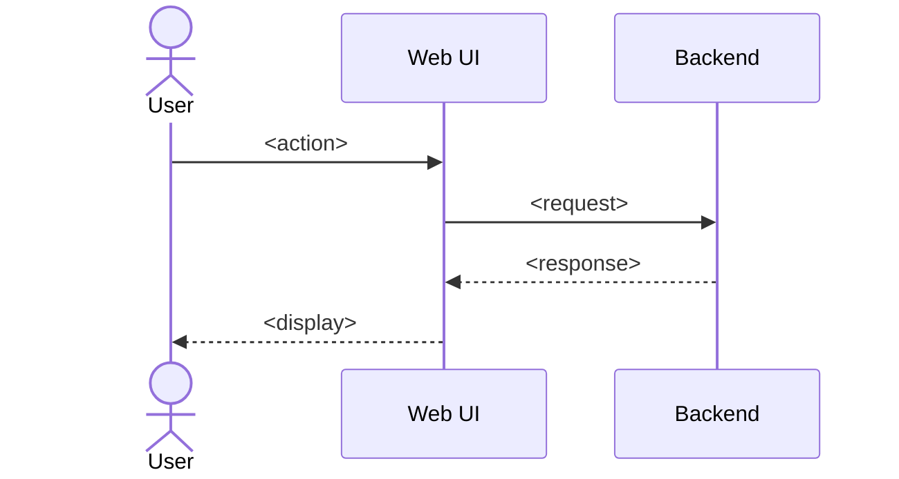

# Use Case Template (Type 4)

> **Copy to use**: `cp templates/4_use-case.md arc42/03-context-and-scope/use-cases/<use-case-name>.md`
> Recommended location: `arc42/03-context-and-scope/use-cases/` (linked from arc42 §6 Runtime View)
> Reference: [Cockburn Casual Use Case](https://www.craiglarman.com/wiki/downloads/cockburn-use-case-fundamentals.pdf) + [Mike Cohn User Stories (INVEST)](https://www.mountaingoatsoftware.com/agile/user-stories) + [Given/When/Then](https://martinfowler.com/bliki/GivenWhenThen.html)
> Length target: **1–3 pages**
>
> **Not used**: full UML Use Case Specification (too heavy). Per the industry survey, User Story + Given/When/Then covers ~90% of the value.
>
> Delete this `> ...` guidance block after copying.

---

# Use Case: <Use case name>

| Metadata             | Value                                                          |
| -------------------- | -------------------------------------------------------------- |
| Status               | Draft / Active / Deprecated                                    |
| Type                 | Use Case Specification (Type 4 / arc42 §6 Runtime View)        |
| Owner                | <name>                                                         |
| Related PRD          | [<feature-name>_PRD](../prds/<file>.md)                        |
| Related Tech Design  | [<module name>](../../../detailed-design/<file>.md)            |
| Related FR           | FR-001, FR-002                                                 |
| Ticket               | <placeholder>                                                  |
| Last Updated         | YYYY-MM-DD                                                     |

---

## 1. User Story (Mike Cohn form)

> As **<role>**, I want **<capability>**, so that **<value>**.

### INVEST checklist

- [ ] **I**ndependent (implementable without ordering against other stories)
- [ ] **N**egotiable (details still negotiable)
- [ ] **V**aluable (delivers user value)
- [ ] **E**stimable (can be sized)
- [ ] **S**mall (fits in a single sprint)
- [ ] **T**estable (acceptance criteria verifiable)

---

## 2. Actors

| Kind      | Actor                       | Role               |
| --------- | --------------------------- | ------------------ |
| Primary   | <user type>                 | <main goal>        |
| Secondary | <external system / agent>   | <supporting role>  |

---

## 3. Preconditions

<!-- Required state and data. -->

- <e.g. user is authenticated>
- <e.g. an active session exists>

---

## 4. Main Success Scenario

<!-- Numbered steps; capture both UI actions and system behaviour. -->

| #   | Actor   | Action          | System behaviour          | Display / Event           |
| --- | ------- | --------------- | ------------------------- | ------------------------- |
| 1   | User    | <action>        | <internal processing>     | <UI change / event>       |
| 2   | System  | -               | <processing>              | <render / persistence>    |
| 3   | User    | <next action>   | …                         | …                         |

---

## 5. Alternative / Exception Flows

<!-- Alternative flows (A1, A2, ...) and exception flows (E1, E2, ...). -->

### Alternative flows

#### A1: <condition>

- What changes
- Expected behaviour

### Exception flows

#### E1: <error condition>

- Detection
- User-facing message
- Recovery procedure

#### E2: <timeout>

- …

---

## 6. Postconditions / Success guarantees

<!-- State guaranteed once the use case completes. -->

- <e.g. artifact deployed (URL is reachable)>
- <e.g. session transitions to "completed" state>

---

## 7. Acceptance Criteria (Given / When / Then)

<!-- Authored so that each AC maps directly to an E2E test; each AC must be verifiable in isolation. -->

### AC-1: <title>

- **Given** <initial state>
- **When** <action>
- **Then** <expected result>

### AC-2: <title>

- **Given** …
- **When** …
- **Then** …

---

## 8. Sequence diagram (optional)

---

## 9. Related

### Internal

- PRD: [<feature-name>_PRD](../prds/<file>.md)
- Tech Design: [<module name>](../../../detailed-design/<file>.md)
- Related use cases: [<other use case>](./<file>.md)

### External

- References
